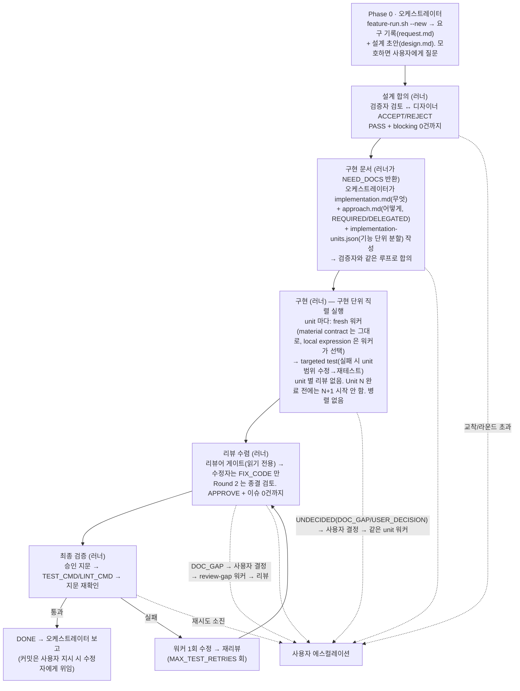

# feature-skill

Claude Code용 다중 에이전트 합의 파이프라인 스킬.

복잡한 피처 하나를 두고 역할이 분리된 AI 실행들이 설계를 합의하고 구현 문서를 합의하고 구현한 뒤
리뷰가 수렴하면 최종 테스트까지 끝낸다. 문서는 검증자와 합의될 때까지 구현을 시작하지 않는다. 리뷰어가 승인하지 않으면 파이프라인도
끝나지 않고 막히면 사람에게 올라온다.

## 역할

역할은 고정이지만 **어느 CLI 로 돌릴지는 모델 ID 로 정한다**: `claude*` → claude CLI, `gpt-*`/`o*`/`codex*` → codex CLI. 이름으로 정할 수 없는 모델은 `config.sh` 의 `<ROLE>_CLI=claude|codex` 로 명시한다. 아래 CLI 열은 기본 설정 기준이다. 각 역할이 요구하는 실행 형태(읽기 전용+스키마 JSON / 편집)는 두 CLI 의 플래그로 각각 옮겨진다(`config.sh` 의 `run_readonly_json_role` / `run_edit_role`).

| 역할 | 모델·effort 설정 | CLI (기본 설정) | 하는 일 |
|---|---|---|---|
| **오케스트레이터·디자이너** | `DESIGNER_MODEL` / `DESIGNER_EFFORT` | claude (대화 세션 + 비대화형 문서 수정) | 요구 해석, 설계 문서·구현 문서 작성/수정, 최종 테스트 |
| **검증자** | `VALIDATOR_MODEL` / `VALIDATOR_EFFORT` | 읽기 전용 (codex `--sandbox read-only` / claude `--tools Read,Grep,Glob`) | 설계·구현 문서에 "지금 구현을 시작하면 안 되는 최소 사유"가 있는지만 판정. 설계 개선자가 아니라 게이트 |
| **워커** | `WORKER_MODEL` / `WORKER_EFFORT` | 편집 (codex `--sandbox workspace-write` / claude `acceptEdits`) | 합의된 구현 문서대로 구현. 문서에 없는 동작 분기는 만들지 않고 `DOC_GAP`/`USER_DECISION`으로 되돌린다 |
| **리뷰어** | `REVIEWER_MODEL` / `REVIEWER_EFFORT` | 읽기 전용 (claude / codex 어느 쪽이든) | 구현 병합 게이트. "지금 verify 로 가면 안 되는 최소 사유"가 있는지만 판정(APPROVE/REQUEST_CHANGES). 코드 개선자가 아니다 |
| **수정자** | `FIXER_MODEL` / `FIXER_EFFORT` | 편집 (claude / codex 어느 쪽이든) | `FIX_CODE` 이슈의 required_outcome 만 구현. 리뷰어 역할·범위 밖 리팩터링 없음. (사용자 지시 시) 커밋 |

제어권은 항상 오케스트레이터 세션 하나에만 있다. 나머지는 전부 비대화형 하위 실행이다.

## 파이프라인



### 왜 문서가 세 개인가

- `design.md`: 왜·무엇을 만드는지(요구 수준). 목표, API/데이터 계약, 에러·동시성 처리, 테스트 기준, 비범위
- `implementation.md`: 무엇을 코드로 바꾸는지를 **코드 사양** 수준으로 — 변경·생성 파일과 순서, 변경할 symbol 과 새 symbol, signature 와 input/output, 호출 관계, 재사용할 기존 symbol, 제거·대체되는 기존 경로, 호출 순서(상태 변경 순서 포함), 테스트할 observable behavior, 완료 뒤 성립하는 구조. 필요하면 함수 단위까지.
- `approach.md`: implementation.md 를 실제 코드로 옮기는 방법 중 **material decision** 을 결정한 문서. 구현 결정 단위로 REQUIRED/DELEGATED 표시. REQUIRED 는 오직 material decision(외부 동작·API 계약, public/package 계약, 영속 데이터·정합성, transaction/lock/concurrency, 보안 경계, layer/객체의 책임 배치, REUSE/EXTEND vs 새 병렬 책임, sync/async, retry/fallback/cache/error semantics, 외부 호출 topology·횟수, 의미 있는 비용 특성, 새 production 구조물, 사용자·convention 이 직접 요구한 방식) 또는 사용자·convention 이 명시적으로 고정한 계약이다. DELEGATED 는 그 계약 안의 local implementation expression(private helper 추출 여부, local 이름, intermediate 유무, if/switch, for/stream, 동등 overload, 작은 local collection 표현)이다. 워커가 이를 convention → material contract → 직접 범위의 기존 표현 → 관용 표현 → 가장 단순한 구현 순으로 정한다. 참조 코드는 백틱 줄 범위(`src/foo/Bar.kt:L40-L68`)로 인용해 러너가 워커 프롬프트에 직접 붙인다. reference 가 고정하는 것은 책임 배치·재사용 symbol·material control-flow·상태 invariant 이고 local 이름·helper 개수·줄 구조 같은 incidental expression 은 approach 가 이유를 적지 않는 한 contract 가 아니다. 판정 예시는 `tests/solution-shape-cases.md`.

"무엇"만 적고 "어떻게"를 비워두면 워커가 제품·아키텍처 판단(책임 위치, 재사용 vs 병렬 구현, 호출 횟수, lock/retry 의미)을 스스로 한다. 그 뒤 어떤 단계도 그것을 결함으로 잡지 않는다. 반대로 helper·local 이름·iteration 까지 문서가 고정하면 검증자를 만족시키기 위한 불필요한 구조가 production 코드에 고착된다. 그래서 **합의 문서는 코드 diff 를 사전에 고정하지 않고 material implementation contract 를 고정한다.** 판정 문장: 두 구현이 request/design/conventions 를 모두 만족하고 외부 동작·책임 배치·재사용 경로·상태 의미·안전성·의미 있는 비용 특성이 동일하다면, 서로 다른 diff 가 나온다는 사실만으로 문서 공백이 아니다(검증자 `CODE_SPEC_GAP` 은 material 구현 계약 하나가 열린 경우만). 워커는 그 계약 안에서 저장소 관례에 맞는 가장 단순한 local 표현을 선택하되 새 responsibility/abstraction(standalone class·interface·repository·service·converter·shared helper·state/result/context 타입)을 임의로 만들지 않는다. material decision 이 비어 있을 때만 `DOC_GAP` 을 낸다. 리뷰어는 material 계약·명시 convention 위반을 동작이 같아도 `CONTRACT_VIOLATION` 으로, 단순 직접 구현으로 대체 가능한 새 standalone abstraction 을 `REDUNDANT_CODE` 로 잡는다. local 표현 차이는 문서에 적혀 있더라도 issue 로 만들지 않는다. 성공 기준은 "같은 문서 → 같은 AST" 가 아니라 "같은 문서 → 같은 제품/아키텍처/material contract → 각 워커가 저장소 관례 안에서 단순한 local 표현을 선택" 이다. 모델별 profile·capability score 는 없다.

### 동작 분기 계약

워커가 요구에 없는 방어 분기·fallback·재시도·타입별 if를 임의로 늘리는 문제는 스타일 규칙이나 정규식 게이트로는 잡히지 않는다. 대신 approach.md에 허용된 결정점을 열거한다. 대상은 외부 동작이나 상태 변경 결과가 갈리는 함수다(선택 사항이며 모든 함수에 쓰지 않는다).

```
## `OrderService.process` 제어 흐름 [REQUIRED]
요구되는 분기:
- B1 / REQ-03: 주문이 없으면 NOT_FOUND 반환
- B2 / REQ-04: 이미 처리된 주문이면 현재 결과 반환
주 경로: 주문 조회 → 처리 실행 → 결과 저장 → 반환
금지: 위 목록에 없는 null 방어 분기 · 호환성 fallback · 재시도 · 타입별 if · boolean flag 흐름 제어
참조 구현: `src/order/ExistingOrderService.java:L40-L68`
```

- 워커는 절이 있는 함수에서 열거된 결정점만 구현한다. 문서에 없는 결정점이 정말 필요하면 구현하지 않고 `UNDECIDED`로 돌려보낸다. 소스에 분기 ID 주석은 금지다.
- 리뷰어는 계약 밖 결정점만 issue 로 낸다(`UNDECLARED_BEHAVIOR` — 절이 없는 함수라도 요구에 없는 외부 동작을 추가했으면 해당, `REDUNDANT_CONTROL_FLOW` — 같은 조건·결과의 반복이나 도달 불가 분기, `CONTRACT_VIOLATION` — 열거된 분기 누락). 정상 대응하는 분기는 출력에서 뺀다.
- 검증자는 이미 합의된 동작이 절에서 빠졌는지만 본다. 새 예외 상황을 발굴해 추가하라고 요구하지 않는다.
- 워커의 `UNDECIDED`는 두 종류다. `DOC_GAP`(제품 동작은 정해져 있는데 approach.md에 그 분기만 빠짐)은 사용자에게 가지 않고 오케스트레이터가 문서를 보강한다. `USER_DECISION`(어느 문서에도 없는 제품 정책)만 사용자에게 간다.

테스트는 implementation.md가 명시한 동작 계약을 검증하는 것만 쓴다. 작성 순서는 강제하지 않는다. 다만 테스트 편의를 위한 운영 코드 변경, 내부 호출·private 상태만 검증하는 테스트, 커버리지 숫자 목적의 테스트는 리뷰어가 `TEST_CONTRACT_GAP` issue로 올린다. 이미 합의된 외부 동작을 검증하는 추가 black-box 테스트는 문서에 이름이 없어도 issue 가 아니다. 커버리지 % 게이트는 없다.
설계가 먼저 굳어야 구현 문서 재작성 낭비가 없다. 구현 문서 검증 단계에서 설계 변경이 필요해지면
검증자·디자이너가 임의로 바꾸지 못하고 "설계 재합의 필요"로 REJECT 기록을 남긴다.

## 러너 — `scripts/feature-run.sh`

오케스트레이터(LLM)는 문서 작성과 사용자 질문만 하고 결정론적 제어는 러너가 맡는다.
`preflight → design → impl → worker → review → verify → done`을 연결하고 판단이 필요한 상태에서만 종료 코드로 돌아온다.
worker 이후는 항상 기존 그대로 review → verify 다. 모든 구현 단위가 끝난 뒤에만 진입하며 unit 사이에는 review/verify 가 없다.

| exit | status | reason |
|---|---|---|
| 0 | `DONE` | 승인 + 전체 테스트 통과 |
| 3 | `NEED_DOCS` | `DESIGN_MISSING` / `IMPL_DOCS_MISSING`(implementation-units.json 누락·형식·부분집합 위반 포함) / `SCOPE_MISSING`: 오케스트레이터가 문서를 쓸 차례 |
| 2 | `NEED_USER` | `UNDECIDED`(워커 DOC_GAP/USER_DECISION) / `REVIEW_DOC_GAP`(리뷰어 DOC_GAP) / `DOC_GAP_SOURCE_CHANGED`: 구현 중 드러난 미결정 solution shape — 사용자 결정이 최종. 답을 `decisions.md` 에 `[USER-QUESTION][scope=impl][review-issue=<id>|worker-gap=<key>]` 태그로 기록하고 approach.md 에 동기화하면 검증자·디자이너·impl 재합의 없이 워커 → 리뷰로 이어진다(`doc-gap-resume.json`) |
| 2 | `NEED_USER` | `ASK_USER` / `DEADLOCK` / `MAX_ROUNDS` / `UNDECIDED` / `TEST_RETRIES_EXHAUSTED` / `APPROVAL_STALE_REPEATED` / 범위·기준선(`SCOPE_*`, `FOREIGN_WORKTREE_CHANGE`) / 구현 단위(`UNITS_MANIFEST_CHANGED` / `UNIT_SCOPE_VIOLATION` / `UNIT_TEST_RETRIES_EXHAUSTED`) / `WORKER_OUTCOME_UNCERTAIN`(워커가 변경을 만든 뒤 유효 결과 없이 non-zero — 자동 재호출·원복 없음, 호출 전 tree 로 복구 후 재실행) / `DESIGNER_SCOPE_VIOLATION`(디자이너가 합의 문서 밖 source 를 변경 — 검증자로 넘기지 않고 fail-closed) |
| 1 | `ENV_ERROR` | CLI·환경 오류 |

`DONE` 뒤 별도 명령 `--feature <id> --finalize`(사용자 승인 뒤에만, 아래 "사용")의 종료 코드는 0 `FINALIZED`(또는 already finalized) / 2 `FINALIZE_CONFLICT`·`APPLIED_CLEANUP_INCOMPLETE`(사용자 확인) / 1 거부·오류(원본·worktree 불변) 다.

재실행은 항상 같은 명령. `run-state.json`(임시 파일 + `mv` 원자 교체)의 stage 힌트를 실제 산출물(합의 PASS 파일, `worker-result.json` + `units/<id>/done.json`, `approved.fingerprint`)과 교차 확인해 재개 지점을 고른다.
러너는 스크립트다. 자동 루프는 (리뷰 이슈 → 수정 → 재리뷰)와 (테스트 실패 → 워커 1회 수정 → 재리뷰 → 재테스트) 둘뿐이다. 구현 단위 안의 (targeted test 실패 → unit 범위 수정 → 재테스트)는 두 번째와 같은 형태·같은 한도다. 그 밖의 막힘은 즉시 사람에게 반환한다. 여기에 더 똑똑한 복구는 일부러 넣지 않았다.

### 구현 단위(implementation unit) 직렬 실행

큰 feature 를 워커 한 번에 맡기면 후반부로 갈수록 conventions 가 밀린다. 기존 utility/predicate 재구현, `a == X || a == Y || a == Z` 나열, 불필요한 if/else, 기존 책임 배치와 다른 구현이 누적된다. 작은 기능 범위에서는 워커가 컨벤션을 잘 따르므로 **설계는 feature 전체를 한 번만 합의하고 코드 작성만 unit 크기로 자른다.** 워커 모델은 그대로 둔다.

- `implementation-units.json` 은 implementation.md/approach.md 가 확정된 뒤 그 범위를 **기능 단위**(접수+담당자 지정 / Drop 요청+상태 조회 / …)로 자른 것이다. 레이어(Repository/Service/Controller)로 나누지 않는다. 같은 파일을 여러 unit 이 순차 수정해도 된다. impl 합의의 입력이라 바꾸면 impl PASS 가 무효가 된다. 워커 진입 시에는 `implementation-units.lock.json` 으로 확정된다(원본≠lock 이면 사람에게).
- 러너는 배열 순서대로 직렬로만 돈다. unit 마다 fresh 워커(이전 unit 의 대화 문맥 없이 worktree 의 코드만 이어받는다) → targeted test(다음 unit 이 깨진 코드 위에 쌓이지 않게 하는 장치, 실패 시 unit 범위 수정 → 재테스트) → `units/<id>/done.json`. unit 별 리뷰·수정자·설계는 없다. 컨벤션·설계 일치 판정은 모든 unit 뒤의 기존 전체 review 한 번이 맡는다. 바뀐 것은 워커 호출 1회가 unit 별 여러 회가 된 것뿐이다. unit scope 는 전체 범위의 부분집합이다. write-set 검사를 전체 범위·unit 범위 두 번 통과해야 한다(원복 없음). 병렬·DAG·우선순위·worker pool 은 넣지 않았다.
- 재실행은 첫 미완료 unit 부터(완료 체크포인트 + spec 지문 대조). 모든 unit 완료 후 **기존 전체 review 와 verify(TEST_CMD/LINT_CMD)를 그대로** 수행한다. unit gate 는 조기 품질 장치이고 최종 승인은 이 전체 review 가 한다.

## 신뢰성 장치

- **수렴 강제**: PASS/APPROVE는 스키마 검증된 JSON 파일로만 인정. 이슈 0건과 동시일 때만 통과
  (판정과 이슈 목록이 모순이면 스크립트가 거부). 동일 이슈가 내용 변화 없이 2라운드 반복되면 교착으로
  판정하고 멈춘다.
- **검증자는 게이트다**: BLOCK은 여섯 가지 입장 조건(요구·결정·계약 위반, 근거 제시, 명시 계약과 다른 결과·보안·영속 데이터·구현 불가 영향, 이번 변경이 만들거나 활성화, 지금 결정 없이는 진행 불가, 정확한 위치)을 모두 만족할 때만 등록된다. 검증자는 최소 불변식만 요구하고 클래스·어노테이션·SQL을 처방하지 않는다. 기존 결함은 이번 피처가 악화시킬 때만 막는다. 파이프라인 운영(git 기준선·지문·테스트 순서)은 러너가 책임지므로 문서 blocking 사유로 삼지 않는다.
- **근거는 스키마와 러너가 강제한다**: blocker마다 증거 유형(`DIRECT_MISMATCH` 문서 대조 / `REACHABLE_FAILURE` 실행 경로 / `UNDECIDED_CHOICE` 순수 정책 미결정)에 맞는 필드가 있어야 하고 사용하지 않는 필드는 비어 있어야 한다. `consensus-loop.sh`가 조건부 필수·상호 배제·id 유일성을 검사하고 어긋나면 검증자 응답 오류로 중단한다.
- **Round 2는 종결 검토다**: Round 1은 입장 조건을 만족하는 문제를 전부 낸다. Round 2부터는 직전 이슈의 해결 여부와 직전 수정이 만든 직접 회귀만 다룬다. 러너는 blocker의 `origin`(UNRESOLVED_PREVIOUS / REVISION_REGRESSION / NEWLY_EXPOSED_BY_REVISION)과 연계 필드(직전 이슈 id, 스냅샷 대비 실제 바뀐 문서)를 대조한다. "라운드당 N건" 같은 페이지네이션은 없다.
- **ASK_USER 분리**: 문서 재작성으로 풀리지 않는 문제(허용 범위 밖 공용 컴포넌트 수정, 제품 정책 선택)는 디자이너를 거치지 않고 `user_question`·`options`를 그대로 사용자에게 전달한다.
- **디자이너는 처방을 복사하지 않는다**: blocking issue를 5단계(요구 근거, 이번 변경 관련, 도달 가능한 경로, 지금 결정 필요, 불변식만 요구)로 판정해 REJECT한다. ACCEPT해도 위반된 불변식만 문서에 반영한다.
- **검증 계약 버전**: 검증자 프롬프트·스키마·러너 검사 중 하나라도 바꾸면 `config.sh`의 `VALIDATOR_CONTRACT_VERSION`을 올린다. 러너가 다른 버전의 이전 PASS를 자동 무효화하므로 `--new` 없이 재실행하면 된다.
- **리뷰어는 병합 게이트다**: issue 는 여섯 가지 입장 조건을 모두 만족할 때만 등록된다. 이번 diff 가 만든 문제, 아홉 category 중 하나, 증거 유형에 맞는 근거, verify 전에 반드시 해결(`UNDECIDED_APPROACH` 는 동작이 맞아도 예외), 기존 결함·장래 개선이 아님, 정확한 위치다. 명명·포맷·선호 리팩터링·정상 대응 분기·`delegated_choices` 보고 누락은 issue 가 아니다. `required_outcome` 은 결과만 적고 기법을 처방하지 않는다. `impl-review-loop.sh` 가 증거 필드(`DIRECT_MISMATCH` / `REACHABLE_FAILURE` / `SEMANTIC_REDUNDANCY`), action 별 필드(`FIX_CODE` / `DOC_GAP` — 리뷰어는 사용자 질문을 만들지 않고, 정책 선택 여부는 재합의 때 문서 검증자가 판정한다), id 유일성, Round 2 `origin`(UNRESOLVED_PREVIOUS / FIX_REGRESSION / NEWLY_EXPOSED_BY_FIX)과 참조 대상(직전 이슈 id, 수정 diff 에 실제로 바뀐 파일)을 강제한다. 리뷰 diff 는 HEAD 가 아니라 기준선 tree(`worker-baseline.tree`) 대비다. 이 tree 는 러너가 워커 진입 직전에 기록하므로 피처 이전의 미커밋 변경은 이번 작업으로 취급되지 않는다. 수정 diff 는 라운드마다 작업 트리를 git tree 객체로 찍어 정확히 잘라낸다.
- **리뷰 Round 2 도 종결 검토다**: 직전 이슈의 해결 여부와 수정자가 만든 직접 회귀만 다룬다. 동일 이슈가 내용 변화 없이 반복되면 두 번째 수정자를 부르지 않고 `DEADLOCK` 으로 멈춘다. `DOC_GAP` 은 수정자를 거치지 않고 문서 단계로 간다. 리뷰어 프롬프트·스키마·루프 검사가 바뀌면 `config.sh`의 `REVIEWER_CONTRACT_VERSION`을 올린다.
- **수정자는 수정자다**: `FIX_CODE` 이슈의 required_outcome 만 구현하고 새 문제를 찾거나 무관한 리팩터링을 하지 않는다. 잘못된 이슈는 코드 대신 `decisions.md` 에 `[fix round N] <id> REJECT` 로 남긴다. `OUT_OF_SCOPE_CHANGE` 는 수정자에게 가지 않는다. 범위 밖 변경은 자동 원복하지 않고 현재 상태를 보존한 채 러너가 `FOREIGN_WORKTREE_CHANGE` 로 사용자에게 반환한다. 되돌릴지 보존할지는 사용자가 결정한다(같은 working tree 의 다른 세션 변경일 수 있고 `pre_bash_guard` 가 `git restore`/`checkout --`/`reset --hard` 를 차단한다). 워커·수정자는 git index 조작(add/reset/stash/restore --staged)이 금지된다. codex 훅의 정규식에 더해 러너·루프가 호출 전후 index 지문(`git ls-files --stage`)을 비교해 바뀌었으면 자동 복구 없이 중단한다(결과 기준 차단). 관련 테스트만 필터로 돌리고 전체 스위트는 verify 단계가 한 번 돌린다.
- **승인 독립성**: 리뷰 세션(`reviewer`)과 수정 세션(`fixer`)은 절대 합치지 않는다.
  마지막 APPROVE 이후 코드가 한 줄이라도 바뀌면 재리뷰 없이 파이프라인을 끝내지 않는다.
- **설계 모호성은 질문으로**: 추측 금지. 사용자 질문/답변은 `decisions.md`에
  `- [USER-QUESTION][scope=design|impl] <질문> → <답>` 형식으로 남아 검증자 이슈 판정(ACCEPT/REJECT)과 구분 추적된다.
  scope 는 질문이 발생한 합의 gate 다(Phase 0·design 루프 → `design`, impl 루프·워커 `USER_DECISION` → `impl`).
- **사용자 결정의 의존성 범위**: design PASS 지문은 `scope=design` 결정만, impl PASS 지문은 `scope=design`+`scope=impl` 결정을 본다.
  impl 합의 중 사용자가 검증자 요구를 기각해도 design PASS 는 그대로 재사용되고 impl 만 재검증된다. `request.md`/`design.md` 변경은 기존처럼 design 부터 다시 돈다.
  scope 없는 옛 형식 줄은 러너가 LLM 호출 전에 `DECISION_SCOPE_REQUIRED` 로 멈추고 사람이 태그를 붙인다(자동 추정 없음). 지문 의미가 바뀌면 `CONSENSUS_CHECKPOINT_VERSION` 을 올린다.
- **커밋 통제**: 워커는 커밋·푸시 불가(claude 훅 + codex 훅 이중 차단). 커밋은 사용자가 요청했을 때만
  오케스트레이터가 1회용 `ALLOW_COMMIT` 플래그를 만들고 수정자에게 위임한다.
- **토큰 절약**: 역할별 세션 재사용(`--session-id`/`--resume`)으로 라운드 간 저장소 재탐색을 없애고
  프롬프트 캐시를 살린다. 사용량은 `usage.jsonl`에 CLI invocation 한 번당 행 1개로 기록한다(아래 "usage telemetry").
- **역할별 규칙 전달**: 필수 `core_rules.md`는 워커에게만 주입하고 선택 `conventions.md`는 디자이너·검증자·워커·리뷰어·수정자 모두에게 주입.
- **실시간 관찰**: 두 루프의 판정, 상세 이슈, 참고사항, 디자이너 반영 결정을 `.agent-work/live.log`에 누적. 러너가 `feature-live` 뷰어 창을 스스로 연다(이미 열려 있으면 `.agent-work/.feature-live.lock/viewer.pid` 로 감지해 다시 열지 않음). 오케스트레이터는 직접 실행하지 않는다. 수동 관찰은 절대 경로 `"$(git rev-parse --show-toplevel)/feature-live"`.

## 구조

```
.claude/
├── settings.json                # claude 훅 등록
├── hooks/
│   ├── core_rules.md            # 워커에게만 주입되는 필수 구현 규칙 (프로젝트에 맞게 수정)
│   ├── inject_conventions.sh    # UserPromptSubmit: 선택적 프로젝트 규범을 세션당 1회 주입 (파이프라인 child 는 제외)
│   └── pre_bash_guard.sh        # 지시 없는 git commit/push 차단 (ALLOW_COMMIT 플래그)
└── skills/feature/
    ├── SKILL.md                 # 파이프라인 정의 (Phase 0 ~ 4, 강제 규칙)
    ├── config.sh                # 모델/effort/라운드 한도/프로젝트 명령 + 가드 + 헬퍼
    ├── prompts/                 # 역할별 페르소나 템플릿 (10개, envsubst 변수 치환 — unit 워커·unit 테스트 수정 포함)
    ├── schemas/                 # 검증자/리뷰어/워커 판정 JSON 스키마 + implementation-units
    └── scripts/
        ├── feature-run.sh       # 러너 — 단계 연결·재개 지점·종료 코드 (--feature <id> 로 전용 worktree 확정)
        ├── feature-worktree.sh  # 피처 전용 worktree 부트스트랩(dirty 원본을 snapshot tree 로 materialize, 재실행 재사용) + finalize(B/O/F 3-way 무커밋 반영·archive·정리)
        ├── consensus-loop.sh    # 문서 합의 루프 — `design` | `impl` 인자 겸용, blocker 근거·Round 2 연계 검사
        ├── impl-review-loop.sh  # 구현 리뷰 수렴 루프 — 리뷰어 게이트, issue 근거·Round 2 연계 검사, 교착 감지
        └── worker-invoke.sh     # run_worker(워커 1회 호출 + 사후 게이트) — feature-run.sh 가 source. tests/worker-regression.sh 가 같은 경로로 실제 워커를 부른다

tests/
├── install-smoke.sh             # LLM 없이 git+jq 로 설치·러너·훅·리뷰 루프 연결 확인
├── smoke-foreign-change.sh      # 범위 밖 변경 원복 금지·범위 가드 회귀 (mock claude)
├── smoke-feature-worktree.sh    # 피처 전용 worktree 부트스트랩·finalize 회귀 — dirty snapshot·격리·재실행 재사용·거부 조건·3-way 반영·충돌·archive·정리
├── smoke-implementation-units.sh # 구현 단위 직렬 실행 회귀 — 순서·겹침 없음·중단/재개·lock·unit scope·unit 사이 리뷰어 0회·targeted test·rolling context (mock)
├── smoke-worker-regression.sh  # worker-regression 하네스 회귀 — 가짜 워커로 DONE=exit 0 / DOC_GAP=exit 2 + 체크포인트가 production 이 인정하는 impl PASS 위에 생김 · provenance 가드 불변 · usage summary v3 (LLM 호출 없음)
├── smoke-cli-exit-mismatch.sh   # CLI 종료코드 ≠ 의미적 완료 회귀 — 워커 유효 결과/불확실 변경(WORKER_OUTCOME_UNCERTAIN)/디자이너·수정자 변경 후 non-zero 는 다음 검증자·리뷰어로, 안전 게이트 우선, read-only 결과 재사용 (mock)
├── validator-cases.md           # 검증자 판정 감도 회귀 세트 설명
├── validator-cases/             # 고정 픽스처 25개 (문서·src·expected.json)
├── validator-regression.sh      # 실제 검증자 모델로 회귀 실행 (프롬프트·스키마 변경 시)
├── reviewer-cases.md            # 리뷰어 판정 감도 회귀 세트 설명
├── reviewer-cases/              # 고정 픽스처 26개 (문서·base/·changed/·expected.json, Round 2 는 fixed/·prev-review.json)
├── reviewer-regression.sh       # 실제 리뷰어 모델로 회귀 실행 (리뷰어 프롬프트·스키마 변경 시)
├── worker-cases.md              # 워커 material-contract 충실도 회귀 세트 설명
├── worker-cases/                # 고정 픽스처 8개 (base/ 컴파일 가능한 Java + run-tests.sh, .agent-work/ 합의 문서·scope·unit 1개, expected.json, assert.py) + lib/javacheck.py
├── worker-regression.sh         # 실제 WORKER_MODEL 로 production run_worker 1회 → deterministic assertion (검증자·리뷰어·수정자 미호출, LLM 판정 없음)
└── solution-shape-cases.md      # REQUIRED/DELEGATED 판정 사례 — material decision 과 local implementation expression 의 경계

.codex/
├── hooks.json                   # codex PreToolUse 훅 등록 (프로젝트 레벨)
└── hooks/worker_guard.sh        # 워커 가드: commit/push 차단 (프로젝트별 보호는 직접 추가)

feature-live                     # 실시간 로그 뷰어 (러너가 자동으로 연다 — tail -f 대체, 수동 실행은 절대 경로)
conventions.md                   # 선택: 모든 역할에 추가 주입할 프로젝트 규범
```

프롬프트(페르소나)·판정 스키마·흐름 제어가 분리되어 있어 문구 수정은 `prompts/*.md`,
판정 필드 변경은 `schemas/*.json`, 루프 정책은 `scripts/*.sh`만 건드리면 된다.

## 요구사항

- [Claude Code](https://claude.com/claude-code) CLI (`claude`): 로그인 상태
- OpenAI Codex CLI (`codex`): 로그인 상태
- `jq`, `uuidgen`, `envsubst`(gettext). macOS: `brew install jq gettext`
- git 저장소 (브랜치 생성·diff 리뷰·훅 판정에 사용)

## 설치

1. 이 저장소의 `.claude/` 와 `.codex/` 를 대상 저장소 루트에 복사한다.
   이미 `.claude/settings.json` 이 있으면 hooks 항목을 병합한다.
   기존 설치를 갱신할 때 `.claude/hooks/inject_conventions.sh` 가 구버전(매 UserPromptSubmit 마다 `conventions.md` 전체 주입)이면
   `install.sh` 가 `[WARN]` 과 함께 `inject_conventions.sh.new` 를 둔다. 새 훅은 interactive 오케스트레이터 세션당 첫 프롬프트에만 주입하고
   (`session_id` 별 마커, `$TMPDIR/claude-conventions-injected/`), 파이프라인 child Claude(`FEATURE_ROLE_CHILD=1`)에는 주입하지 않는다.
   child 는 `run_readonly_json_role`/`run_edit_role` 이 conventions 를 이미 명시 전달하므로 훅까지 넣으면 turn 마다 중복 cache read 가 생긴다.
   커스터마이즈가 없으면 `.new` 로 덮어쓰면 된다.
2. `.claude/skills/feature/config.sh` 의 `CHANGE_ME` 를 채운다.
   ```bash
   DESIGNER_MODEL="<디자이너 모델>"
   DESIGNER_EFFORT="<지원 effort>"
   VALIDATOR_MODEL="<검증자 모델>"
   VALIDATOR_EFFORT="<지원 effort>"       # 게이트 모드 기본 medium — 검증자는 구현을 막을 최소 사유만 판정
   WORKER_MODEL="<워커 모델>"
   WORKER_EFFORT="<지원 effort>"
   REVIEWER_MODEL="<리뷰어 모델>"
   REVIEWER_EFFORT="<지원 effort>"
   FIXER_MODEL="<수정자 모델>"
   FIXER_EFFORT="<지원 effort>"
   TEST_CMD="<프로젝트 테스트 명령>"    # 예: "npm test", "./gradlew test", "venv/bin/pytest tests -q"
   LINT_CMD="<프로젝트 린트/빌드 검증 명령>"   # 복잡도·중복·dead code 분석기도 여기에 구성(eslint/sonar, radon, detekt, knip, jscpd…)
   ```
   모델별 지원 effort가 다르므로 모델과 effort를 함께 맞춘다. 실제 허용 여부는 각 CLI가 검증한다.
   빈 값이나 `CHANGE_ME`가 남으면 config.sh 가드가 모든 스크립트 실행을 거부한다.
3. (선택) 프로젝트별 보호가 필요하면 훅을 추가한다. 생성 코드·마이그레이션 편집 금지 같은 규칙은
   `.codex/hooks/worker_guard.sh` 와 claude `PreToolUse` 훅에 같은 패턴(경로 grep → exit 2)으로 넣는다.
4. (선택) 저장소 루트에 `conventions.md`를 두면 모든 역할에 주입된다. 파일이 없으면 생략한다. `core_rules.md`는 워커에게만 별도로 주입된다.
5. `.gitignore` 에 `.agent-work/` 를 추가한다.

## 사용

`DESIGNER_MODEL`·`DESIGNER_EFFORT`와 맞춘 Claude Code 세션에서 "feature" 또는 "피처"를 명시하며 기능 구현을 요청하면
스킬이 발동한다. 사소한 수정·단일 파일 변경에는 쓰지 않는다.

```
피처: 주문 취소 API 추가하고 재고 원복까지 처리해줘
```

피처는 처음부터 전용 git worktree 에서 돈다. 러너를 `--feature <id>` 로 실행하면 branch `feature/<id>` 와 worktree `../<repo>-feature-<id>` 를 id 로 결정론적으로 정하고, 없으면 원본 working tree 의 현재 상태(미커밋 tracked 변경·untracked 포함, gitignore 파일·`.agent-work` 제외)를 bootstrap 커밋 없이 snapshot tree 로 옮겨 만든다(원본 branch/HEAD/index/working tree 불변, snapshot 도중 원본이 바뀌면 실패). 같은 id 로 다시 실행하면 그 worktree 와 `.agent-work` 를 이어서 쓴다. 서로 다른 피처는 동시에 실행할 수 있고 서로에게도 원본에도 보이지 않는다. 완료 후 merge·commit·worktree 삭제는 자동으로 하지 않는다. `DONE` 뒤 오케스트레이터가 사용자에게 묻는다. 사용자가 승인했을 때만 `--finalize` 로 결과를 원본 working tree 에 **커밋 없이** 반영하고 worktree·피처 브랜치를 정리한다. 수동 `--worktree <dir> --branch <name>` 도 그대로 쓸 수 있다.

```bash
bash .claude/skills/feature/scripts/feature-run.sh --feature 018               # → ../<repo>-feature-018, branch feature/018
bash .claude/skills/feature/scripts/feature-run.sh --feature 018 --finalize    # DONE 뒤, 사용자 승인 뒤에만. 원본 working tree 에서 실행
```

finalize 는 `HEAD` 대비 diff 를 붙이지 않는다. worktree 생성 시 원본의 dirty 상태까지 snapshot 했으므로 B = 생성 당시 tree(`feature.json.bootstrap_tree`), O = 지금 원본, F = 지금 worktree 로 둔다. `merge(B, O, F)` 를 `git merge-tree` 로 object 상에서만 계산한 뒤, 임시 index 로 원본 working tree 에만 materialize 한다. 원본 index(staged 상태)·branch·HEAD 는 그대로이고 commit·stash 도 없다. 반영 전에 `<원본>/.agent-work/archive/worktree/<id>/<timestamp>/`(manifest.json, feature.patch(B→F, binary 포함), finalize.json, agent-work/) 를 남기고, 반영 결과를 다시 snapshot 해 기대 merge tree 와 같을 때만 `git worktree remove` + `git branch -D` 를 한다. 같은 hunk 충돌은 자동 해결하지 않고 `FINALIZE_CONFLICT`(exit 2) 로 전부 보존한 채 멈춘다. 정리만 실패하면 `APPLIED_CLEANUP_INCOMPLETE` 로 기록하고 재실행 시 정리만 재시도한다. 성공한 피처에 같은 명령을 다시 내리면 `already finalized` 로 끝난다(worktree 재생성·delta 재적용 없음). 커밋은 finalize 와 별개로 사용자가 따로 요청할 때만 하며, 그때는 `finalize.json.source_after_tree` 와 지금 원본 tree 가 같아야 한다(`feature_finalized_source_current <id>`).

진행 상황 관찰은 러너가 시작할 때 `feature-live` 창을 자동으로 연다(같은 worktree 에 이미 열려 있으면 lock 으로 감지해 다시 열지 않는다). 수동으로 열려면 별도 터미널에서 절대 경로로 실행한다(피처 worktree 에 `feature-live` 가 없으면 원본 저장소 루트의 파일을 worktree 로 `cd` 한 뒤 실행):

```bash
"$(git rev-parse --show-toplevel)/feature-live"
```

파이프라인 시작 전에 켜도 `live.log` 생성을 기다렸다가 자동으로 스트리밍을 시작한다.

라운드 한도는 `config.sh`에서 조정한다:

```bash
MAX_SPEC_ROUNDS=2    # 문서 합의 라운드 (design/impl 각각 적용)
MAX_IMPL_ROUNDS=1    # 구현 리뷰-수정 라운드 (리뷰 2회 + 수정 1회. 첫 수정으로 안 풀리면 남은 이슈를 사용자에게)
MAX_TEST_RETRIES=1   # 최종 테스트 실패 시 워커 재수정 허용 횟수
```

## 산출물 (`.agent-work/`, gitignore 대상)

| 파일 | 내용 |
|---|---|
| `request.md` | 요구 원문 + 해석 범위 + 제외 사항 |
| `design.md` / `implementation.md` / `approach.md` | 합의된 설계 / 구현 문서(무엇) / 구현 방식 문서(어떻게, REQUIRED/DELEGATED) |
| `implementation-units.json` / `.lock.json` | 구현 단위 manifest(기능 단위, 배열 순서 = 실행 순서) / 워커 진입 시 확정한 불변 사본 |
| `units/<id>/` | unit 별 체크포인트: `unit.json`·`scope.json`·`before.tree`·`worker-before/after.tree`·`worker-result.json`·`targeted-test-NN.log`·`done.json` |
| `run-state.json` / `worker-result.json` | 러너 상태(재개 힌트) / 워커 결과 JSON(`DONE`/`UNDECIDED`, `undecided`, `delegated_choices`, `tests` — 모든 unit 완료 후 unit 결과를 합친 것) |
| `worker-baseline.tree` | 워커 진입 직전 작업 트리의 git tree SHA. 리뷰 diff 와 `new_file_roots` 소유권 판정의 시점 기준선(변경 소유권 증거가 아니며 원복 근거로 쓰지 않는다) |
| `decisions.md` | 이슈별 ACCEPT/REJECT 사유 + `[USER-QUESTION][scope=design|impl]` 기록 |
| `reviews/` | 라운드별 판정 JSON (`validator-design-*`, `validator-impl-*`, `impl-attempt-*/reviewer-*`) |
| `state.json` / `usage.jsonl` / `live.log` | 단계 상태 / invocation 별 usage telemetry / 실시간 로그 |
| `cli-anomalies.jsonl` / `worker-outcome.guard.json` / `designer-scope.guard.json` | CLI 종료코드 불일치 복구 기록(append-only: role·cli·label·raw_exit_code·recovery=STRUCTURED_RESULT\|FORWARD_TO_VALIDATOR\|FORWARD_TO_REVIEWER·evidence; `usage.jsonl` 의 raw exit_code/success 는 그대로) / 결과 없는 불확실 워커 변경의 fail-closed 가드(호출 전 tree) / 디자이너의 문서 밖 source 변경 가드(호출 전 tree). codex read-only 결과는 invocation 전용 임시 `-o`(`<out>.invocation-<id>.tmp`)에만 쓰이고 usable 할 때만 `<out>` 으로 옮겨진다 |
| `archive/` | 이전 피처 산출물 보관 (새 피처 시작 시 자동 이동) |
| `feature.json` | (피처 worktree) 부트스트랩 기록 — version 2: branch·worktree·source_root·head·`snapshot_tree`·`bootstrap_tree`(finalize 기준선 B)·mode·created_at |
| `archive/worktree/<id>/<timestamp>/` | (원본) finalize 기록 — `manifest.json`·`feature.patch`(B→F)·`finalize.json`(status·B/O/F/merge tree·`source_after_tree`·cleanup·충돌 목록)·`agent-work/`(worktree 산출물 사본) |

### usage telemetry (`usage.jsonl`)

`usage.jsonl` 한 행 = CLI invocation 한 번의 관측 telemetry. 세션 누계가 아니며, 같은 Claude 세션을 `--resume`해도 행은 invocation 별로 기록한다.
writer 는 append-only 원시 기록만 하고 session 별 delta·누적 total·가격 추정을 하지 않는다. 집계는 그 위에서 한다(`usage_summary` 또는 아래 jq).
Claude 세션은 stage/attempt 단위다(`designer-design`/`designer-impl`, `validator-design`/`validator-impl`, `reviewer-a01`, `fixer-a01`, `worker-unit-<id>`).
같은 stage/attempt 안의 라운드·재시도만 `--resume` 하고 다른 stage/attempt 로는 대화 문맥을 넘기지 않는다(상태는 문서·JSON·체크포인트·지문으로만).

```json
{"invocation_id":"…","label":"impl-review-a01-round-01","role":"REVIEWER","cli":"claude","model":"claude-sonnet-5","session":"…",
 "cost_usd":1.2914188,"input_uncached":38,"cache_read":2509959,"cache_write":158503,"output":14701,"input_effective":2668500,
 "tokens_total":null,"num_turns":12,"duration_ms":123456,"duration_api_ms":110000,"exit_code":0,"success":true,"source":"claude-result","recorded_at":"…"}
```

- `input_uncached` 는 cache read/write 를 제외한 입력. `input_effective` = `input_uncached + cache_read + cache_write`. 진단 편의용 파생값이며 provider billing 공식 필드는 아니다.
- `cache_read` 는 현재 context 크기가 아니라 해당 invocation 안의 model turn 들에서 읽힌 cache 토큰 누계일 수 있으므로 `num_turns` 와 함께 해석한다.
- `null` 은 0 이 아니라 "관측 불가" 다. codex 는 `codex exec --json` 이벤트 JSONL 의 `turn.completed.usage` 를 invocation 안에서 합산해 `input_uncached`/`cache_read`/`cache_write`/`output`/`reasoning_output`/`num_turns`/`tokens_total` 을 채운다(`source: codex-events`). 비용은 provenance 로 나뉜다. `cost_usd` 는 provider 가 보고한 실제 비용(claude, codex 는 항상 null)이다. `estimated_cost_usd` 는 codex 토큰 × 명시적 가격표(`codex_model_pricing`, 2026-09-23 standard rate, 가격표에 없는 모델은 null/`cost_kind: unknown`)의 추정치이며 실제 청구액이 아니다. `usage_summary` 는 `reported_cost_usd`(= `cost_usd`)·`estimated_cost_usd`·`combined_cost_usd_estimate`(둘의 합)·`cost_unknown_invocations` 를 따로 낸다.
- CLI 가 실패해도 파싱 가능한 usage 가 있으면 `exit_code`/`success` 와 함께 기록한다. 같은 `label` 이 재시도되면 행이 여러 개이며 `invocation_id` 로 구분한다.
- 옛 행(`in`/`out`)은 rewrite 하지 않는다. `usage_summary` 는 두 형식을 함께 읽는다.
- `usage_summary [usage.jsonl]` 은 전체와 `by_role`/`by_label`/`by_session` 그룹마다 `invocations`·`cost_usd`·`cache_read`·`num_turns`·`output`·`cache_read_per_turn`(cache_read 합 ÷ num_turns 합, num_turns 를 보고한 행만; 없으면 `null`)을 낸다. 어느 역할·호출·세션이 cache read 를 만드는지 보는 관측값이며 임계치·자동 세션 교체 같은 판단은 하지 않는다.

**변경 전후 비용 측정.** `usage.jsonl` 은 러너가 부른 child invocation(디자이너·검증자·워커·리뷰어·수정자)의 telemetry 만 담는다. interactive 오케스트레이터 세션 자체의 turn·cache read 는 여기에 없다. 그래서 두 층을 따로 비교한다.

- 상위 오케스트레이터: CodeBurn 에서 같은 피처 A/B 실행의 turns·calls·cache read·비용을 본다(conventions 훅 변경의 효과는 이 층에만 나타난다).
- 하위 역할(child): 같은 피처를 돌린 두 `usage.jsonl` 에 아래를 적용해 대조한다(세션 분리·child 중복 주입 제거의 효과는 이 층에 나타난다).

성공 기준을 `cache_read` 단독 감소에 두지 않는다. 세션을 stage/attempt 로 나누면 새 세션마다 저장소를 다시 읽으므로 `cache_write`·`input_uncached` 가 늘 수 있다. 동일 피처 A/B 실행의 총비용(CodeBurn 상위 + `cost_usd` 하위)·invocations/calls·num_turns·cache_read·cache_write·input_uncached 를 함께 놓고 총비용이 줄었는지로 판단한다.

```bash
bash -c 'source .claude/skills/feature/config.sh; usage_summary .agent-work/usage.jsonl' \
  | jq '{invocations, num_turns, cache_read, cache_write, input_uncached, cache_read_per_turn, cost_usd, sessions: (.by_session|length), by_role}'
```

```bash
jq -s '{cost_usd: (map(.cost_usd // 0) | add), input_uncached: (map(.input_uncached // 0) | add),
        cache_read: (map(.cache_read // 0) | add), cache_write: (map(.cache_write // 0) | add), output: (map(.output // 0) | add)}' .agent-work/usage.jsonl
```

## 테스트

```bash
bash tests/install-smoke.sh          # 설치·러너·훅 연결. LLM 호출 없음
bash tests/smoke-foreign-change.sh   # 범위 밖 변경 원복 금지·범위 가드. LLM 호출 없음
bash tests/smoke-feature-worktree.sh # 피처 전용 worktree 부트스트랩·격리·재실행 + finalize(3-way 반영·충돌·archive·정리·재실행). LLM 호출 없음
bash tests/smoke-implementation-units.sh # 구현 단위 직렬 실행·targeted test·재개·unit 사이 리뷰어 0회. LLM 호출 없음
bash tests/smoke-consensus-fingerprint.sh # 사용자 결정 scope 별 PASS 지문·stage 회귀·DECISION_SCOPE_REQUIRED. LLM 호출 없음
bash tests/smoke-worker-regression.sh     # worker-regression 하네스: 가짜 워커 DONE/DOC_GAP 종료 코드·impl PASS provenance 전제·usage summary. LLM 호출 없음
bash tests/smoke-cli-exit-mismatch.sh     # 편집 역할이 변경을 만든 뒤 non-zero 로 끝나도 같은 편집을 반복하지 않음(WORKER_OUTCOME_UNCERTAIN·검증자/리뷰어 게이트). LLM 호출 없음
touch .claude/ALLOW_REAL_LLM_REGRESSION   # 유료 회귀 1회 승인 — 사용자 지시 후에만. 없으면 회귀 스크립트가 exit 3 으로 차단
bash tests/validator-regression.sh   # 검증자 판정 감도. 사례당 실제 검증자 호출 1회
bash tests/reviewer-regression.sh    # 리뷰어 판정 감도. 사례당 실제 리뷰어 호출 1회
bash tests/worker-regression.sh      # 워커 material-contract 충실도. 사례당 실제 WORKER_MODEL 호출 1회 (production run_worker 경로), 판정은 deterministic
```

스모크 테스트는 매 변경마다 돌린다. 회귀 세트는 해당 역할의 프롬프트·스키마·루프의 연계 검사를 바꿨을 때만 같은 모델·effort로 돌린다. 검증자 사례는 "기존 결함이지만 이번 피처와 무관 → PASS", "사용자가 명시한 유틸 재사용 누락 → BLOCK", "정책 미결정 → ASK_USER", "Round 2에서 옛 문제를 새로 제기하면 회귀", "책임 위치·public 계약이 두 구조를 허용 → CODE_SPEC_GAP BLOCK", "helper/local 이름/동등 overload/bounded local collection 미정 → PASS", "항목별 조회 vs 일괄 조회·retry 여부 미정 → BLOCK" 같은 판정 경계를, 리뷰어 사례는 "diff 밖 기존 결함 → APPROVE", "문서가 정하지 않은 명명만 다르고 계약 준수 → APPROVE", "합의된 동작의 추가 black-box 테스트 → APPROVE", "지정 유틸 재구현·문서 밖 fallback·중복 분기·내부 호출 테스트 → REQUEST_CHANGES", "문서가 helper 없음·지역 변수 이름을 적어 두었어도 같은 클래스 private helper·다른 이름·동등 overload → APPROVE", "bounded in-memory contains vs Set → APPROVE, 항목별 DB 조회 vs 일괄 조회 미정 → DOC_GAP", "불필요한 outcome/kind abstraction → REDUNDANT_CODE", "formatter·import 순서 차이만 → APPROVE", "Round 2 에서 옛 문제 제기 → 회귀", "수정자의 범위 밖 변경 → REQUEST_CHANGES" 를 고정한다. 종료 코드를 먼저 대조하고 기대값은 핵심 필드만 본다. 자연어 본문은 사람이 확인한다. 회귀 실행에는 해당 역할의 모델·effort·CLI 경로만 실제 값이면 된다. `TEST_CMD`·`LINT_CMD`는 스크립트가 복사본에서 `true`로 바꾼다. 전제와 결과 해석은 `tests/validator-cases.md`·`tests/reviewer-cases.md`에 있다.

워커 회귀(`tests/worker-regression.sh`)는 검증자·리뷰어와 다른 질문을 묻는다: **현재 `WORKER_MODEL` 이 합의된 material contract(implementation.md + approach.md)를 지키면서 local expression 을 스스로 정하고, 새 standalone 구조물을 만들지 않으며, material 공백에서만 DOC_GAP 을 내는가**. 사례마다 컴파일 가능한 작은 Java 저장소와 합의 완료로 취급하는 문서·unit 1개를 둔다. 그리고 `scripts/worker-invoke.sh` 의 `run_worker`(feature-run.sh 가 쓰는 그 함수. 프롬프트 조립·WORKER_RULES·REFERENCE CODE·implementation-context·스키마·CLI 라우팅·usage 기록·사후 게이트 포함)로 실제 워커를 정확히 1회 부른 뒤 결과 JSON·호출 전후 tree·diff 를 expected.json 과 `assert.py`(`lib/javacheck.py`)로만 판정한다. 판정은 material 항목뿐이다. 지정 symbol 재사용·재구현 없음·상태 변경 순서·batch 1회·새 파일/타입/public 메서드 없음·문서 밖 분기 없음·NEW 구조물의 public 계약을 본다. 지역 변수 이름·같은 클래스 private helper·for/stream 은 판정하지 않는다. 검증자·리뷰어·수정자는 부르지 않고 LLM 으로 채점하지도 않는다. 워커 실패·잘못된 UNDECIDED(local 선택으로 DOC_GAP) 는 그대로 FAIL 이다. 사례와 판정 기준은 `tests/worker-cases.md`.

## 트러블슈팅

- **`[FAIL] config.sh 의 CHANGE_ME 항목을 먼저 채우세요.`**: 설치 2번을 안 한 것. `TEST_CMD`/`LINT_CMD`를 채운다.
- **`[FAIL] codex 실행 실패 (모델 '...' 확인)`**: codex 계정에서 해당 모델 ID가 유효한지 확인 (`codex -m` 후보 목록).
- **`[FAIL] 모델 '...' 의 CLI 를 이름으로 정하지 못함`**: 모델 ID 가 `claude*`/`gpt-*`/`o*`/`codex*` 어디에도 맞지 않는다. `config.sh` 에 `<ROLE>_CLI=claude|codex` 를 지정한다.
- **루프가 exit 2로 멈춤**: 설계된 에스컬레이션이다. `state.json`의 `ASK_USER`/`DEADLOCK`/`MAX_ROUNDS_EXCEEDED`와 마지막 리뷰 JSON을 보고 사람이 결정한 뒤 재개한다.
- **`[FAIL] 근거·연계 필드가 빠지거나 어긋난 blocker`**: 검증자가 스키마는 맞췄지만 증거 유형·action·Round 2 origin 규칙을 어긴 것. 재실행하면 되고 반복되면 `tests/validator-regression.sh`로 프롬프트 회귀를 본다.
- **검증 라운드가 다시 돎**: `VALIDATOR_CONTRACT_VERSION`이 올라가 이전 PASS가 무효화된 것. 정상이며 `--new`는 쓰지 않는다(decisions.md가 비워진다).
- **`NEED_USER(DECISION_SCOPE_REQUIRED)`**: `decisions.md`에 scope 없는 `- [USER-QUESTION] …` 줄이 있다. detail 의 행번호를 보고 `[USER-QUESTION][scope=design]` 또는 `[USER-QUESTION][scope=impl]` 로 고친 뒤 재실행(LLM 은 호출되지 않았다).
- **`[FAIL] 근거·연계 필드가 빠지거나 어긋난 issue`** / **`리뷰 schema_version 이 현재 계약과 다름`**: 리뷰어가 스키마는 맞췄지만 증거 유형·action·Round 2 origin 규칙을 어겼거나, 업데이트 후 `config.sh`의 `REVIEWER_CONTRACT_VERSION`이 병합되지 않은 것. 재실행하면 되고 반복되면 `tests/reviewer-regression.sh`로 프롬프트 회귀를 본다.
- **리뷰 단계가 `NEED_USER(REVIEW_DOC_GAP)`로 돌아옴**: 리뷰어가 `DOC_GAP` 이슈(`user_question`/`options`)를 냈다. 사용자가 고른 답을 `decisions.md` 에 `- [USER-QUESTION][scope=impl][review-issue=<id>] <질문> → <답>` 으로 적고 approach.md 에 반영한 뒤 재실행한다. 그러면 검증자·디자이너 없이 review-gap 워커 1회(같은 리뷰의 FIX_CODE 포함) → 리뷰 순으로 진행된다. 워커 `UNDECIDED` 도 같은 경로다(`worker-gap=<unit>#<n>` 태그).
- **codex 훅이 안 걸림**: codex를 저장소 루트에서 실행했는지 확인 (`hooks.json`의 가드 경로가 상대 경로).
- **이전 피처 문맥이 섞임**: `.agent-work/.session-*` 가 남아 있는 것. 새 피처 시작 시 Phase 0의 archive 절차를 따른다.
- **오케스트레이터에 conventions 가 안 보임**: 훅은 세션당 첫 프롬프트에만 넣는다(마커 `$TMPDIR/claude-conventions-injected/<session_id>`). 새 세션을 열거나 마커를 지우면 다시 주입된다. `FEATURE_ROLE_CHILD=1` 환경에서는 의도적으로 넣지 않는다.
- **`[FINALIZE_CONFLICT]`**: 피처(B→F)와 원본(B→O)이 같은 부분을 바꿨다. 아무것도 반영되지 않았고 worktree·브랜치·index 도 그대로다. `finalize.json.conflict_files` 의 파일을 원본이나 worktree 에서 정리한 뒤(worktree 를 고쳤으면 러너 재실행으로 재승인) 같은 명령을 다시 낸다.
- **`[FAIL] feature.json ... 에 finalize 기준선(bootstrap_tree)이 없다`**: 생성 시점 tree 를 알 수 없는 경우다. version 1 metadata 의 `new-from-branch` worktree 가 여기에 해당한다. 기준선을 추측하지 않으므로 결과를 사람이 직접 옮긴다(worktree·브랜치 유지).
- **`APPLIED_CLEANUP_INCOMPLETE`**: 원본 반영은 끝났고 되돌리지 않는다. `finalize.json.cleanup.error` 의 원인(브랜치가 다른 worktree 에 체크아웃, ref lock 등)을 해소하고 같은 명령을 다시 내면 정리만 재시도한다.

## Claude Code Agent Teams와의 차이

Claude Code에는 여러 Claude 인스턴스가 협업하는 실험 기능 [Agent Teams](https://code.claude.com/docs/en/agent-teams.md)가 있다
(`CLAUDE_CODE_EXPERIMENTAL_AGENT_TEAMS=1`, 기본 비활성화). 목표는 겹치지만 이 스킬을 대체하지는 않는다:

- **교차 벤더 검증**: Agent Teams는 Claude 모델 전용이다. 이 스킬의 핵심인 "명세·구현을 타사 모델(OpenAI Codex)이
  교차 검증"하는 구조는 팀 기능으로 만들 수 없다. 같은 모델끼리는 맹점도 공유하기 쉽다는 전제에서 출발한 설계다.
- **결정론적 수렴 강제**: 이 스킬은 스키마 검증된 PASS/APPROVE JSON, 모순 응답 거부, 교착 감지, 라운드 한도를
  셸 스크립트가 강제한다. Agent Teams의 협업 흐름은 모델 재량이 크다. 강제는 훅 종료 코드로 우회 구현해야 한다.
- **반대로 Agent Teams가 나은 것**: 팀원 간 직접 통신, 공유 작업 리스트·의존성 자동 관리. 독립 작업 여러 개를
  병렬 분업할 때는 Agent Teams가 자연스럽다.

피처 하나에 품질 관문이 필요한 경우, 설계 합의부터 구현과 리뷰 수렴까지 가야 하는 작업에 이 스킬을 쓴다. 독립 작업 여러 개의 병렬 처리는 Agent Teams.

## 라이선스

MIT
