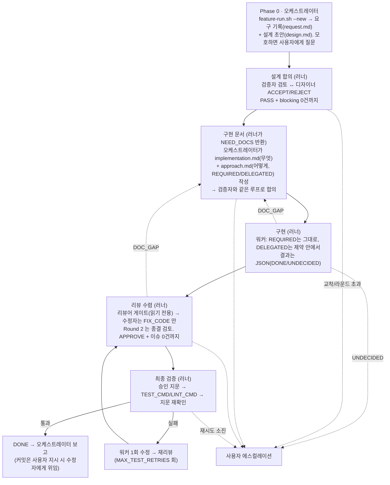

# feature-skill

Claude Code용 다중 에이전트 합의 파이프라인 스킬.

복잡한 피처 하나를 역할이 분리된 AI 실행들이 "설계 합의 → 구현 문서 합의 → 구현 → 리뷰 수렴 → 최종 테스트"로
끝까지 처리한다. 문서는 검증자와 합의될 때까지 구현을 시작하지 않는다. 리뷰어가 승인하지 않으면 파이프라인도
끝나지 않고 막히면 사람에게 올라온다.

## 역할

| 역할 | 모델·effort 설정 | CLI | 하는 일 |
|---|---|---|---|
| **오케스트레이터·디자이너** | `DESIGNER_MODEL` / `DESIGNER_EFFORT` | claude (대화 세션 + 비대화형 문서 수정) | 요구 해석, 설계 문서·구현 문서 작성/수정, 최종 테스트 |
| **검증자** | `VALIDATOR_MODEL` / `VALIDATOR_EFFORT` | codex `--sandbox read-only` | 설계·구현 문서에 "지금 구현을 시작하면 안 되는 최소 사유"가 있는지만 판정. 설계 개선자가 아니라 게이트 |
| **워커** | `WORKER_MODEL` / `WORKER_EFFORT` | codex `--sandbox workspace-write` | 합의된 구현 문서대로 구현. 문서에 없는 동작 분기는 만들지 않고 `DOC_GAP`/`USER_DECISION`으로 되돌린다 |
| **리뷰어** | `REVIEWER_MODEL` / `REVIEWER_EFFORT` | claude (읽기 전용 비대화형) | 구현 병합 게이트. "지금 verify 로 가면 안 되는 최소 사유"가 있는지만 판정(APPROVE/REQUEST_CHANGES). 코드 개선자가 아니다 |
| **수정자** | `FIXER_MODEL` / `FIXER_EFFORT` | claude (비대화형) | `FIX_CODE` 이슈의 required_outcome 만 구현. 리뷰어 역할·범위 밖 리팩터링 없음. (사용자 지시 시) 커밋 |

제어권은 항상 오케스트레이터 세션 하나에만 있다. 나머지는 전부 비대화형 하위 실행이다.

## 파이프라인



### 왜 문서가 세 개인가

- `design.md`: 왜·무엇을 만드는지(요구 수준). 목표, API/데이터 계약, 에러·동시성 처리, 테스트 기준, 비범위
- `implementation.md`: 무엇을 코드로 바꾸는지(도메인 지식). 파일 목록·순서, 클래스/함수 수준 계획, 테스트 목록, 완료 기준
- `approach.md`: 어떻게 구현하는지(CS 지식), 구현 결정 단위로 REQUIRED/DELEGATED 표시. DELEGATED가 기본값이고 외부 동작·영속 데이터 정합성·보안 경계가 갈리거나 사용자가 방식을 명시한 결정만 REQUIRED다. 근거는 기존 프로젝트 패턴 최우선이며 참조 코드는 백틱 줄 범위(`src/foo/Bar.kt:L40-L68`)로 인용한다. 러너가 그 범위를 워커 프롬프트에 직접 붙인다.

"무엇"만 적고 "어떻게"를 비워두면 워커가 테스트만 통과하는 수준의 코드를 짜고 그 뒤 어떤 단계도 그것을 결함으로 잡지 않는다. 그래서 워커는 REQUIRED 결정을 그대로 옮기는 타이피스트로 둔다.

### 동작 분기 계약

워커가 요구에 없는 방어 분기·fallback·재시도·타입별 if를 임의로 늘리는 문제는 스타일 규칙이나 정규식 게이트로는 잡히지 않는다. 대신 approach.md에서 외부 동작이나 상태 변경 결과가 갈리는 함수에 "허용된 결정점"을 열거한다(선택 사항이며 모든 함수에 쓰지 않는다).

```
## `OrderService.process` 제어 흐름 [REQUIRED]
요구되는 분기:
- B1 / REQ-03: 주문이 없으면 NOT_FOUND 반환
- B2 / REQ-04: 이미 처리된 주문이면 현재 결과 반환
주 경로: 주문 조회 → 처리 실행 → 결과 저장 → 반환
금지: 위 목록에 없는 null 방어 분기 · 호환성 fallback · 재시도 · 타입별 if · boolean flag 흐름 제어
참조 구현: `src/order/ExistingOrderService.java:L40-L68`
```

- 워커는 절이 있는 함수에서 열거된 결정점만 구현하고 문서에 없는 결정점이 정말 필요하면 구현하지 않고 `UNDECIDED`로 돌려보낸다. 소스에 분기 ID 주석은 달지 않는다.
- 리뷰어는 계약 밖 결정점만 issue 로 낸다(`UNDECLARED_BEHAVIOR` — 절이 없는 함수라도 요구에 없는 외부 동작을 추가했으면 해당, `REDUNDANT_CONTROL_FLOW` — 같은 조건·결과의 반복이나 도달 불가 분기, `CONTRACT_VIOLATION` — 열거된 분기 누락). 정상 대응하는 분기는 출력하지 않는다.
- 검증자는 이미 합의된 동작이 절에서 빠졌는지만 본다. 새 예외 상황을 발굴해 추가하라고 요구하지 않는다.
- 워커의 `UNDECIDED`는 두 종류다. `DOC_GAP`(제품 동작은 정해져 있는데 approach.md에 그 분기만 빠짐)은 사용자에게 가지 않고 오케스트레이터가 문서를 보강한다. `USER_DECISION`(어느 문서에도 없는 제품 정책)만 사용자에게 간다.

테스트는 implementation.md가 명시한 동작 계약을 검증하는 것만 쓴다. 작성 순서는 강제하지 않지만 테스트 편의를 위한 운영 코드 변경, 내부 호출·private 상태만 검증하는 테스트, 커버리지 숫자 목적의 테스트는 리뷰어가 `TEST_CONTRACT_GAP` issue로 올린다. 이미 합의된 외부 동작을 검증하는 추가 black-box 테스트는 문서에 이름이 없어도 issue 가 아니다. 커버리지 % 게이트는 두지 않는다.
설계가 먼저 굳어야 구현 문서 재작성 낭비가 없다. 구현 문서 검증 단계에서 설계 변경이 필요해지면
검증자·디자이너가 임의로 바꾸지 못하고 "설계 재합의 필요"로 REJECT 기록을 남긴다.

## 러너 — `scripts/feature-run.sh`

오케스트레이터(LLM)는 문서 작성과 사용자 질문만 하고 결정론적 제어는 러너가 맡는다.
`preflight → design → impl → worker → review → verify → done`을 연결하고 판단이 필요한 상태에서만 종료 코드로 돌아온다.

| exit | status | reason |
|---|---|---|
| 0 | `DONE` | 승인 + 전체 테스트 통과 |
| 3 | `NEED_DOCS` | `DESIGN_MISSING` / `IMPL_DOCS_MISSING` / `APPROACH_GAP`: 오케스트레이터가 문서를 쓰거나 보강할 차례 |
| 2 | `NEED_USER` | `ASK_USER` / `DEADLOCK` / `MAX_ROUNDS` / `UNDECIDED` / `TEST_RETRIES_EXHAUSTED` / `APPROVAL_STALE_REPEATED` |
| 1 | `ENV_ERROR` | CLI·환경 오류 |

재실행은 항상 같은 명령. `run-state.json`(임시 파일 + `mv` 원자 교체)의 stage 힌트를 실제 산출물(합의 PASS 파일, `worker-result.json`, `approved.fingerprint`)과 교차 확인해 재개 지점을 고른다.
러너는 agent 가 아니다. 자동 루프는 (리뷰 이슈 → 수정 → 재리뷰)와 (테스트 실패 → 워커 1회 수정 → 재리뷰 → 재테스트) 둘뿐이다. 그 밖의 막힘은 즉시 사람에게 반환한다. 여기에 더 똑똑한 복구는 일부러 넣지 않았다.

## 신뢰성 장치

- **수렴 강제**: PASS/APPROVE는 스키마 검증된 JSON 파일로만 인정. 이슈 0건과 동시일 때만 통과
  (판정과 이슈 목록이 모순이면 스크립트가 거부). 동일 이슈가 내용 변화 없이 2라운드 반복되면 교착으로
  판정하고 멈춘다.
- **검증자는 게이트다**: BLOCK은 여섯 가지 입장 조건(요구·결정·계약 위반, 근거 제시, 명시 계약과 다른 결과·보안·영속 데이터·구현 불가 영향, 이번 변경이 만들거나 활성화, 지금 결정 없이는 진행 불가, 정확한 위치)을 모두 만족할 때만 등록된다. 검증자는 최소 불변식만 요구하고 클래스·어노테이션·SQL을 처방하지 않는다. 기존 결함은 이번 피처가 악화시킬 때만 막는다. 파이프라인 운영(git 기준선·지문·테스트 순서)은 러너 책임이라 문서 blocking 사유가 아니다.
- **근거는 스키마와 러너가 강제한다**: blocker마다 증거 유형(`DIRECT_MISMATCH` 문서 대조 / `REACHABLE_FAILURE` 실행 경로 / `UNDECIDED_CHOICE` 순수 정책 미결정)에 맞는 필드가 있어야 하고 사용하지 않는 필드는 비어 있어야 한다. `consensus-loop.sh`가 조건부 필수·상호 배제·id 유일성을 검사하고 어긋나면 검증자 응답 오류로 중단한다.
- **Round 2는 종결 검토다**: Round 1은 입장 조건을 만족하는 문제를 전부 낸다. Round 2부터는 직전 이슈의 해결 여부와 직전 수정이 만든 직접 회귀만 다루며 blocker에 `origin`(UNRESOLVED_PREVIOUS / REVISION_REGRESSION / NEWLY_EXPOSED_BY_REVISION)과 연계 필드(직전 이슈 id, 스냅샷 대비 실제 바뀐 문서)를 러너가 대조한다. "라운드당 N건" 같은 페이지네이션은 없다.
- **ASK_USER 분리**: 문서 재작성으로 풀리지 않는 문제(허용 범위 밖 공용 컴포넌트 수정, 제품 정책 선택)는 디자이너를 거치지 않고 `user_question`·`options`를 그대로 사용자에게 전달한다.
- **디자이너는 처방을 복사하지 않는다**: blocking issue를 5단계(요구 근거, 이번 변경 관련, 도달 가능한 경로, 지금 결정 필요, 불변식만 요구)로 판정해 REJECT하고 ACCEPT해도 위반된 불변식만 문서에 반영한다.
- **검증 계약 버전**: 검증자 프롬프트·스키마·러너 검사 중 하나라도 바꾸면 `config.sh`의 `VALIDATOR_CONTRACT_VERSION`을 올린다. 러너가 다른 버전의 이전 PASS를 자동 무효화하므로 `--new` 없이 재실행하면 된다.
- **리뷰어는 병합 게이트다**: issue 는 여섯 가지 입장 조건(이번 diff 가 만든 문제, 여덟 category 중 하나, 증거 유형에 맞는 근거, verify 전에 반드시 수정, 기존 결함·장래 개선이 아님, 정확한 위치)을 모두 만족할 때만 등록된다. 명명·포맷·선호 리팩터링·정상 대응 분기·`delegated_choices` 보고 누락은 issue 가 아니다. `required_outcome` 은 결과만 적고 기법을 처방하지 않는다. `impl-review-loop.sh` 가 증거 필드(`DIRECT_MISMATCH` / `REACHABLE_FAILURE` / `SEMANTIC_REDUNDANCY`), action 별 필드(`FIX_CODE` / `DOC_GAP` — 리뷰어는 사용자 질문을 만들지 않고, 정책 선택 여부는 재합의 때 문서 검증자가 판정한다), id 유일성, Round 2 `origin`(UNRESOLVED_PREVIOUS / FIX_REGRESSION / NEWLY_EXPOSED_BY_FIX)과 참조 대상(직전 이슈 id, 수정 diff 에 실제로 바뀐 파일)을 강제한다. 리뷰 diff 는 HEAD 가 아니라 러너가 워커 진입 직전에 기록한 기준선 tree(`worker-baseline.tree`) 대비이므로 피처 이전의 미커밋 변경은 이번 작업으로 취급되지 않고, 수정 diff 는 라운드마다 작업 트리를 git tree 객체로 찍어 정확히 잘라낸다.
- **리뷰 Round 2 도 종결 검토다**: 직전 이슈의 해결 여부와 수정자가 만든 직접 회귀만 다룬다. 동일 이슈가 내용 변화 없이 반복되면 두 번째 수정자를 부르지 않고 `DEADLOCK` 으로 멈춘다. `DOC_GAP` 은 수정자를 거치지 않고 문서 단계로 간다. 리뷰어 프롬프트·스키마·루프 검사가 바뀌면 `config.sh`의 `REVIEWER_CONTRACT_VERSION`을 올린다.
- **수정자는 수정자다**: `FIX_CODE` 이슈의 required_outcome 만 구현하고 새 문제를 찾거나 무관한 리팩터링을 하지 않는다. 잘못된 이슈는 코드 대신 `decisions.md` 에 `[fix round N] <id> REJECT` 로 남긴다. `OUT_OF_SCOPE_CHANGE` 는 이번 작업이 바꾼 범위 밖 기존 파일을 워커 진입 기준선 tree 로 `git restore --worktree` 로만 원복한다 — HEAD 원복·index 변경 금지, 기준선이 없으면 DEFER 로 보고만 한다. 워커·수정자는 git index 조작(add/reset/stash/restore --staged)이 금지된다 — codex 훅의 정규식에 더해 러너·루프가 호출 전후 index 지문(`git ls-files --stage`)을 비교해 바뀌었으면 자동 복구 없이 중단한다(결과 기준 차단). 관련 테스트만 필터로 돌리고 전체 스위트는 verify 단계가 한 번 돌린다.
- **승인 독립성**: 리뷰 세션(`reviewer`)과 수정 세션(`fixer`)은 절대 합치지 않는다.
  마지막 APPROVE 이후 코드가 한 줄이라도 바뀌면 재리뷰 없이 파이프라인을 끝내지 않는다.
- **설계 모호성은 질문으로**: 추측 금지. 사용자 질문/답변은 `decisions.md`에
  `- [USER-QUESTION] <질문> → <답>` 형식으로 남아 검증자 이슈 판정(ACCEPT/REJECT)과 구분 추적된다.
- **커밋 통제**: 워커는 커밋·푸시 불가(claude 훅 + codex 훅 이중 차단). 커밋은 사용자가 요청했을 때만
  오케스트레이터가 1회용 `ALLOW_COMMIT` 플래그를 만들고 수정자에게 위임한다.
- **토큰 절약**: 역할별 세션 재사용(`--session-id`/`--resume`)으로 라운드 간 저장소 재탐색을 없애고
  프롬프트 캐시를 살린다. 사용량은 `usage.jsonl`에 라운드별 누적.
- **역할별 규칙 전달**: 필수 `core_rules.md`는 워커에게만 주입하고 선택 `conventions.md`는 디자이너·검증자·워커·리뷰어·수정자 모두에게 주입.
- **실시간 관찰**: 두 루프의 판정, 상세 이슈, 참고사항, 디자이너 반영 결정을 `.agent-work/live.log`에 누적. `./feature-live` 로 스트리밍 관찰.

## 구조

```
.claude/
├── settings.json                # claude 훅 등록
├── hooks/
│   ├── core_rules.md            # 워커에게만 주입되는 필수 구현 규칙 (프로젝트에 맞게 수정)
│   ├── inject_conventions.sh    # UserPromptSubmit: 선택적 프로젝트 규범 주입
│   └── pre_bash_guard.sh        # 지시 없는 git commit/push 차단 (ALLOW_COMMIT 플래그)
└── skills/feature/
    ├── SKILL.md                 # 파이프라인 정의 (Phase 0 ~ 4, 강제 규칙)
    ├── config.sh                # 모델/effort/라운드 한도/프로젝트 명령 + 가드 + 헬퍼
    ├── prompts/                 # 역할별 페르소나 템플릿 (8개, envsubst 변수 치환)
    ├── schemas/                 # 검증자/리뷰어/워커 판정 JSON 스키마
    └── scripts/
        ├── feature-run.sh       # 러너 — 단계 연결·재개 지점·종료 코드
        ├── consensus-loop.sh    # 문서 합의 루프 — `design` | `impl` 인자 겸용, blocker 근거·Round 2 연계 검사
        └── impl-review-loop.sh  # 구현 리뷰 수렴 루프 — 리뷰어 게이트, issue 근거·Round 2 연계 검사, 교착 감지

tests/
├── install-smoke.sh             # LLM 없이 git+jq 로 설치·러너·훅·리뷰 루프 연결 확인
├── validator-cases.md           # 검증자 판정 감도 회귀 세트 설명
├── validator-cases/             # 고정 픽스처 9개 (문서·src·expected.json)
├── validator-regression.sh      # 실제 검증자 모델로 회귀 실행 (프롬프트·스키마 변경 시)
├── reviewer-cases.md            # 리뷰어 판정 감도 회귀 세트 설명
├── reviewer-cases/              # 고정 픽스처 11개 (문서·base/·changed/·expected.json, Round 2 는 fixed/·prev-review.json)
└── reviewer-regression.sh       # 실제 리뷰어 모델로 회귀 실행 (리뷰어 프롬프트·스키마 변경 시)

.codex/
├── hooks.json                   # codex PreToolUse 훅 등록 (프로젝트 레벨)
└── hooks/worker_guard.sh        # 워커 가드: commit/push 차단 (프로젝트별 보호는 직접 추가)

feature-live                     # 실시간 로그 뷰어 (./feature-live — tail -f 대체)
conventions.md                   # 선택: 모든 역할에 추가 주입할 프로젝트 규범
```

프롬프트(페르소나)·판정 스키마·흐름 제어가 분리되어 있어 문구 수정은 `prompts/*.md`,
판정 필드 변경은 `schemas/*.json`, 루프 정책은 `scripts/*.sh`만 건드리면 된다.

## 요구사항

- [Claude Code](https://claude.com/claude-code) CLI (`claude`): 로그인 상태
- OpenAI Codex CLI (`codex`): 로그인 상태
- `jq`, `uuidgen`, `envsubst`(gettext). macOS: `brew install jq gettext`
- git 저장소 (브랜치 생성·diff 리뷰·훅 판정에 사용)

## 설치

1. 이 저장소의 `.claude/` 와 `.codex/` 를 대상 저장소 루트에 복사한다.
   이미 `.claude/settings.json` 이 있으면 hooks 항목을 병합한다.
2. `.claude/skills/feature/config.sh` 의 `CHANGE_ME` 를 채운다.
   ```bash
   DESIGNER_MODEL="<디자이너 모델>"
   DESIGNER_EFFORT="<지원 effort>"
   VALIDATOR_MODEL="<검증자 모델>"
   VALIDATOR_EFFORT="<지원 effort>"       # 게이트 모드 기본 medium — 검증자는 구현을 막을 최소 사유만 판정
   WORKER_MODEL="<워커 모델>"
   WORKER_EFFORT="<지원 effort>"
   REVIEWER_MODEL="<리뷰어 모델>"
   REVIEWER_EFFORT="<지원 effort>"
   FIXER_MODEL="<수정자 모델>"
   FIXER_EFFORT="<지원 effort>"
   TEST_CMD="<프로젝트 테스트 명령>"    # 예: "npm test", "./gradlew test", "venv/bin/pytest tests -q"
   LINT_CMD="<프로젝트 린트/빌드 검증 명령>"   # 복잡도·중복·dead code 분석기도 여기에 구성(eslint/sonar, radon, detekt, knip, jscpd…)
   ```
   모델별 지원 effort가 다르므로 모델과 effort를 함께 맞춘다. 실제 허용 여부는 각 CLI가 검증한다.
   빈 값이나 `CHANGE_ME`가 남으면 config.sh 가드가 모든 스크립트 실행을 거부한다.
3. (선택) 프로젝트별 보호가 필요하면 훅을 추가한다. 생성 코드·마이그레이션 편집 금지 같은 규칙은
   `.codex/hooks/worker_guard.sh` 와 claude `PreToolUse` 훅에 같은 패턴(경로 grep → exit 2)으로 넣는다.
4. (선택) 저장소 루트에 `conventions.md`를 두면 모든 역할에 주입된다. 파일이 없으면 생략한다. `core_rules.md`는 워커에게만 별도로 주입된다.
5. `.gitignore` 에 `.agent-work/` 를 추가한다.

## 사용

`DESIGNER_MODEL`·`DESIGNER_EFFORT`와 맞춘 Claude Code 세션에서 "feature" 또는 "피처"를 명시하며 기능 구현을 요청하면
스킬이 발동한다. 사소한 수정·단일 파일 변경에는 쓰지 않는다.

```
피처: 주문 취소 API 추가하고 재고 원복까지 처리해줘
```

진행 상황 관찰 (별도 터미널, 저장소 루트에서):

```bash
./feature-live
```

파이프라인 시작 전에 켜도 `live.log` 생성을 기다렸다가 자동으로 스트리밍을 시작한다.

라운드 한도는 `config.sh`에서 조정한다:

```bash
MAX_SPEC_ROUNDS=2    # 문서 합의 라운드 (design/impl 각각 적용)
MAX_IMPL_ROUNDS=1    # 구현 리뷰-수정 라운드 (리뷰 2회 + 수정 1회. 첫 수정으로 안 풀리면 남은 이슈를 사용자에게)
MAX_TEST_RETRIES=1   # 최종 테스트 실패 시 워커 재수정 허용 횟수
```

## 산출물 (`.agent-work/`, gitignore 대상)

| 파일 | 내용 |
|---|---|
| `request.md` | 요구 원문 + 해석 범위 + 제외 사항 |
| `design.md` / `implementation.md` / `approach.md` | 합의된 설계 / 구현 문서(무엇) / 구현 방식 문서(어떻게, REQUIRED/DELEGATED) |
| `run-state.json` / `worker-result.json` | 러너 상태(재개 힌트) / 워커 결과 JSON(`DONE`/`UNDECIDED`, `undecided`, `delegated_choices`, `tests`) |
| `worker-baseline.tree` | 워커 진입 직전 작업 트리의 git tree SHA. 리뷰 diff 와 범위 밖 변경 원복의 기준선 |
| `decisions.md` | 이슈별 ACCEPT/REJECT 사유 + `[USER-QUESTION]` 기록 |
| `reviews/` | 라운드별 판정 JSON (`validator-design-*`, `validator-impl-*`, `impl-attempt-*/reviewer-*`) |
| `state.json` / `usage.jsonl` / `live.log` | 단계 상태 / 토큰·비용 누적 / 실시간 로그 |
| `archive/` | 이전 피처 산출물 보관 (새 피처 시작 시 자동 이동) |

## 테스트

```bash
bash tests/install-smoke.sh          # 설치·러너·훅 연결. LLM 호출 없음
touch .claude/ALLOW_REAL_LLM_REGRESSION   # 유료 회귀 1회 승인 — 사용자 지시 후에만. 없으면 회귀 스크립트가 exit 3 으로 차단
bash tests/validator-regression.sh   # 검증자 판정 감도. 사례당 실제 검증자 호출 1회
bash tests/reviewer-regression.sh    # 리뷰어 판정 감도. 사례당 실제 리뷰어 호출 1회
```

스모크 테스트는 매 변경마다 돌린다. 회귀 세트는 해당 역할의 프롬프트·스키마·루프의 연계 검사를 바꿨을 때만 같은 모델·effort로 돌린다. 검증자 사례는 "기존 결함이지만 이번 피처와 무관 → PASS", "사용자가 명시한 유틸 재사용 누락 → BLOCK", "정책 미결정 → ASK_USER", "Round 2에서 옛 문제를 새로 제기하면 회귀" 같은 판정 경계를, 리뷰어 사례는 "diff 밖 기존 결함 → APPROVE", "명명만 다르고 계약 준수 → APPROVE", "합의된 동작의 추가 black-box 테스트 → APPROVE", "지정 유틸 재구현·문서 밖 fallback·중복 분기·내부 호출 테스트 → REQUEST_CHANGES", "Round 2 에서 옛 문제 제기 → 회귀", "수정자의 범위 밖 변경 → REQUEST_CHANGES" 를 고정한다. 종료 코드를 먼저 대조하고 기대값은 핵심 필드만 본다. 자연어 본문은 사람이 확인한다. 회귀 실행에는 해당 역할의 모델·effort·CLI 경로만 실제 값이면 되고 `TEST_CMD`·`LINT_CMD`는 스크립트가 복사본에서 `true`로 바꾼다. 전제와 결과 해석은 `tests/validator-cases.md`·`tests/reviewer-cases.md`에 있다.

## 트러블슈팅

- **`[FAIL] config.sh 의 CHANGE_ME 항목을 먼저 채우세요.`**: 설치 2번을 안 한 것. `TEST_CMD`/`LINT_CMD`를 채운다.
- **`[FAIL] codex 실행 실패 (모델 '...' 확인)`**: codex 계정에서 해당 모델 ID가 유효한지 확인 (`codex -m` 후보 목록).
- **루프가 exit 2로 멈춤**: 버그가 아니라 설계된 에스컬레이션. `state.json`의 `ASK_USER`/`DEADLOCK`/`MAX_ROUNDS_EXCEEDED`와 마지막 리뷰 JSON을 보고 사람이 결정한 뒤 재개한다.
- **`[FAIL] 근거·연계 필드가 빠지거나 어긋난 blocker`**: 검증자가 스키마는 맞췄지만 증거 유형·action·Round 2 origin 규칙을 어긴 것. 재실행하면 되고 반복되면 `tests/validator-regression.sh`로 프롬프트 회귀를 본다.
- **검증 라운드가 다시 돎**: `VALIDATOR_CONTRACT_VERSION`이 올라가 이전 PASS가 무효화된 것. 정상이며 `--new`는 쓰지 않는다(decisions.md가 비워진다).
- **`[FAIL] 근거·연계 필드가 빠지거나 어긋난 issue`** / **`리뷰 schema_version 이 현재 계약과 다름`**: 리뷰어가 스키마는 맞췄지만 증거 유형·action·Round 2 origin 규칙을 어겼거나, 업데이트 후 `config.sh`의 `REVIEWER_CONTRACT_VERSION`이 병합되지 않은 것. 재실행하면 되고 반복되면 `tests/reviewer-regression.sh`로 프롬프트 회귀를 본다.
- **리뷰 단계가 `NEED_DOCS(APPROACH_GAP)`로 돌아옴**: 리뷰어가 `DOC_GAP` 이슈를 냈다. `state.json.review`의 해당 이슈 `required_outcome`대로 approach.md 를 보강하고 재실행하면 검증자 재합의 → 워커 재개 순으로 진행된다.
- **codex 훅이 안 걸림**: codex를 저장소 루트에서 실행했는지 확인 (`hooks.json`의 가드 경로가 상대 경로).
- **이전 피처 문맥이 섞임**: `.agent-work/.session-*` 가 남아 있는 것. 새 피처 시작 시 Phase 0의 archive 절차를 따른다.

## Claude Code Agent Teams와의 차이

Claude Code에는 여러 Claude 인스턴스가 협업하는 실험 기능 [Agent Teams](https://code.claude.com/docs/en/agent-teams.md)가 있다
(`CLAUDE_CODE_EXPERIMENTAL_AGENT_TEAMS=1`, 기본 비활성화). 목표는 겹치지만 이 스킬을 대체하지는 않는다:

- **교차 벤더 검증**: Agent Teams는 Claude 모델 전용이다. 이 스킬의 핵심인 "명세·구현을 타사 모델(OpenAI Codex)이
  교차 검증"하는 구조는 팀 기능으로 만들 수 없다. 같은 모델끼리는 맹점도 공유하기 쉽다는 전제에서 출발한 설계다.
- **결정론적 수렴 강제**: 이 스킬은 스키마 검증된 PASS/APPROVE JSON, 모순 응답 거부, 교착 감지, 라운드 한도를
  셸 스크립트가 강제한다. Agent Teams의 협업 흐름은 모델 재량이 크다. 강제는 훅 종료 코드로 우회 구현해야 한다.
- **반대로 Agent Teams가 나은 것**: 팀원 간 직접 통신, 공유 작업 리스트·의존성 자동 관리. 독립 작업 여러 개를
  병렬 분업할 때는 Agent Teams가 자연스럽다.

피처 하나에 품질 관문이 필요한 경우, 설계 합의부터 구현과 리뷰 수렴까지 가야 하는 작업에 이 스킬을 쓴다. 독립 작업 여러 개의 병렬 처리는 Agent Teams.

## 라이선스

MIT
