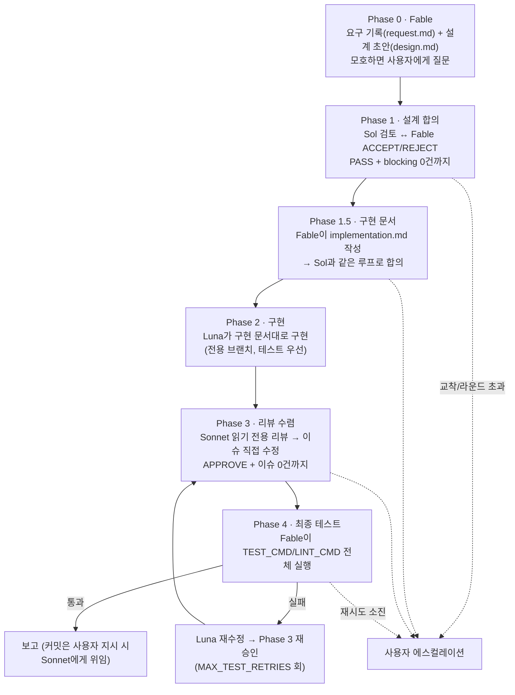

# feature-skill

Claude Code용 **다중 에이전트 합의 파이프라인 스킬**.

복잡한 피처 하나를 4개의 AI 역할이 "설계 합의 → 구현 문서 합의 → 구현 → 리뷰 수렴 → 최종 테스트"로
끝까지 처리한다. 문서는 검증자와 합의될 때까지 구현을 시작하지 않고, 코드는 리뷰어가 승인할 때까지
파이프라인이 끝나지 않으며, 막히면 사람에게 올라온다.

## 역할

| 역할 | 모델 (기본값) | CLI | 하는 일 |
|---|---|---|---|
| **Fable** | claude-fable-5 | claude (대화 세션) | 오케스트레이터. 요구 해석, 설계 문서·구현 문서 작성/수정, 최종 테스트 |
| **Sol** | gpt-5.6-sol | codex `--sandbox read-only` | 설계·구현 문서를 각각 검증, BLOCK/PASS 판정 |
| **Luna** | gpt-5.6-luna | codex `--sandbox workspace-write` | 합의된 구현 문서대로 메인 구현 (테스트 우선) |
| **Sonnet** | claude-sonnet-5 | claude (비대화형) | 구현 리뷰 → 이슈 직접 수정, (사용자 지시 시) 커밋 |

제어권은 항상 Fable 세션 하나에만 있다. 나머지는 전부 비대화형 하위 실행이다.

## 파이프라인



### 왜 문서가 두 개인가

- `design.md` — **무엇을** 만드는지: 목표, API/데이터 계약, 에러·동시성 처리, 테스트 기준, 비범위
- `implementation.md` — **어떻게** 만드는지: 파일 목록·순서, 클래스/함수 수준 계획, 테스트 목록, 완료 기준

설계가 먼저 굳어야 구현 문서 재작성 낭비가 없다. 구현 문서 검증 단계에서 설계 변경이 필요해지면
Sol/Fable이 임의로 바꾸지 못하고 "설계 재합의 필요"로 REJECT 기록을 남긴다.

## 신뢰성 장치

- **수렴 강제** — PASS/APPROVE는 스키마 검증된 JSON 파일로만 인정. 이슈 0건과 동시일 때만 통과
  (판정과 이슈 목록이 모순이면 스크립트가 거부). 동일 이슈가 내용 변화 없이 2라운드 반복되면 교착으로
  판정하고 멈춘다.
- **승인 독립성** — 리뷰 세션(`sonnet-review`)과 수정 세션(`sonnet-fix`)은 절대 합치지 않는다.
  마지막 APPROVE 이후 코드가 한 줄이라도 바뀌면 재리뷰 없이 파이프라인을 끝내지 않는다.
- **설계 모호성은 질문으로** — 추측 금지. 사용자 질문/답변은 `decisions.md`에
  `- [USER-QUESTION] <질문> → <답>` 형식으로 남아 Sol 이슈 판정(ACCEPT/REJECT)과 구분 추적된다.
- **커밋 통제** — 워커는 커밋·푸시 불가(claude 훅 + codex 훅 이중 차단). 커밋은 사용자가 요청했을 때만
  Fable이 1회용 `ALLOW_COMMIT` 플래그를 만들고 Sonnet에게 위임한다.
- **토큰 절약** — 역할별 세션 재사용(`--session-id`/`--resume`)으로 라운드 간 저장소 재탐색을 없애고
  프롬프트 캐시를 살린다. 사용량은 `usage.jsonl`에 라운드별 누적.
- **실시간 관찰** — 두 루프의 진행 로그가 `.agent-work/live.log`에 쌓인다. `./feature-live` 로 스트리밍 관찰.

## 구조

```
.claude/
├── settings.json                # claude 훅 등록
├── hooks/
│   ├── core_rules.md            # 워커에게 매 실행 주입되는 핵심 규칙 (프로젝트에 맞게 수정)
│   ├── inject_core_rules.sh     # UserPromptSubmit: 매 턴 룰 재주입
│   └── pre_bash_guard.sh        # 지시 없는 git commit/push 차단 (ALLOW_COMMIT 플래그)
└── skills/feature/
    ├── SKILL.md                 # 파이프라인 정의 (Phase 0 ~ 4, 강제 규칙)
    ├── config.sh                # 모델/effort/라운드 한도/프로젝트 명령 + 가드 + 헬퍼
    ├── prompts/                 # 역할별 페르소나 템플릿 (7개, envsubst 변수 치환)
    ├── schemas/                 # Sol/Sonnet 판정 JSON 스키마
    └── scripts/
        ├── consensus-loop.sh    # 문서 합의 루프 — `design` | `impl` 인자 겸용
        └── impl-review-loop.sh  # 구현 리뷰 수렴 루프

.codex/
├── hooks.json                   # codex PreToolUse 훅 등록 (프로젝트 레벨)
└── hooks/luna_guard.sh          # Luna 가드: commit/push 차단 (프로젝트별 보호는 직접 추가)

feature-live                     # 실시간 로그 뷰어 (./feature-live — tail -f 대체)
```

프롬프트(페르소나)·판정 스키마·흐름 제어가 분리되어 있어 문구 수정은 `prompts/*.md`,
판정 필드 변경은 `schemas/*.json`, 루프 정책은 `scripts/*.sh`만 건드리면 된다.

## 요구사항

- [Claude Code](https://claude.com/claude-code) CLI (`claude`) — 로그인 상태
- OpenAI Codex CLI (`codex`) — 로그인 상태
- `jq`, `uuidgen`, `envsubst`(gettext) — macOS: `brew install jq gettext`
- git 저장소 (브랜치 생성·diff 리뷰·훅 판정에 사용)

## 설치

1. 이 저장소의 `.claude/` 와 `.codex/` 를 대상 저장소 루트에 복사한다.
   이미 `.claude/settings.json` 이 있으면 hooks 항목을 병합한다.
2. `.claude/skills/feature/config.sh` 의 `CHANGE_ME` 를 채운다.
   ```bash
   TEST_CMD="<프로젝트 테스트 명령>"    # 예: "npm test", "./gradlew test", "venv/bin/pytest tests -q"
   LINT_CMD="<프로젝트 린트/빌드 검증 명령>"
   ```
   모델 ID가 환경과 다르면 함께 수정한다 (`claude`는 `/model`, `codex`는 `codex -m` 후보로 확인).
   **안 채우면 config.sh 가드가 모든 스크립트 실행을 거부한다.**
3. (선택) 프로젝트별 보호가 필요하면 훅을 추가한다 — 생성 코드·마이그레이션 편집 금지 같은 규칙은
   `.codex/hooks/luna_guard.sh` 와 claude `PreToolUse` 훅에 같은 패턴(경로 grep → exit 2)으로 넣는다.
4. `.gitignore` 에 `.agent-work/` 를 추가한다.

## 사용

Claude Code 세션(effort `medium`)에서 **"feature" 또는 "피처"를 명시**하며 기능 구현을 요청하면
스킬이 발동한다. 사소한 수정·단일 파일 변경에는 쓰지 않는다.

```
피처: 주문 취소 API 추가하고 재고 원복까지 처리해줘
```

진행 상황 관찰 (별도 터미널, 저장소 루트에서):

```bash
./feature-live
```

파이프라인 시작 전에 켜도 `live.log` 생성을 기다렸다가 자동으로 스트리밍을 시작한다.

라운드 한도는 `config.sh`에서 조정한다:

```bash
MAX_SPEC_ROUNDS=3    # 문서 합의 라운드 (design/impl 각각 적용)
MAX_IMPL_ROUNDS=2    # 구현 리뷰-수정 라운드
MAX_TEST_RETRIES=1   # 최종 테스트 실패 시 Luna 재수정 허용 횟수
```

## 산출물 (`.agent-work/`, gitignore 대상)

| 파일 | 내용 |
|---|---|
| `request.md` | 요구 원문 + 해석 범위 + 제외 사항 |
| `design.md` / `implementation.md` | 합의된 설계 / 구현 문서 |
| `decisions.md` | 이슈별 ACCEPT/REJECT 사유 + `[USER-QUESTION]` 기록 |
| `reviews/` | 라운드별 판정 JSON (`sol-design-*`, `sol-impl-*`, `impl-attempt-*/sonnet-*`) |
| `state.json` / `usage.jsonl` / `live.log` | 단계 상태 / 토큰·비용 누적 / 실시간 로그 |
| `archive/` | 이전 피처 산출물 보관 (새 피처 시작 시 자동 이동) |

## 트러블슈팅

- **`[FAIL] config.sh 의 CHANGE_ME 항목을 먼저 채우세요.`** — 설치 2번을 안 한 것. `TEST_CMD`/`LINT_CMD`를 채운다.
- **`[FAIL] codex 실행 실패 (모델 '...' 확인)`** — codex 계정에서 해당 모델 ID가 유효한지 확인 (`codex -m` 후보 목록).
- **루프가 exit 2로 멈춤** — 버그가 아니라 설계된 에스컬레이션. `state.json`의 `DEADLOCK`/`MAX_ROUNDS_EXCEEDED`와 마지막 리뷰 JSON을 보고 사람이 결정한 뒤 재개한다.
- **codex 훅이 안 걸림** — codex를 저장소 루트에서 실행했는지 확인 (`hooks.json`의 가드 경로가 상대 경로).
- **이전 피처 문맥이 섞임** — `.agent-work/.session-*` 가 남아 있는 것. 새 피처 시작 시 Phase 0의 archive 절차를 따른다.

## Claude Code Agent Teams와의 차이

Claude Code에는 여러 Claude 인스턴스가 협업하는 실험 기능 [Agent Teams](https://code.claude.com/docs/en/agent-teams.md)가 있다
(`CLAUDE_CODE_EXPERIMENTAL_AGENT_TEAMS=1`, 기본 비활성화). 목표는 겹치지만 이 스킬을 대체하지는 않는다:

- **교차 벤더 검증** — Agent Teams는 Claude 모델 전용이다. 이 스킬의 핵심인 "명세·구현을 타사 모델(OpenAI Codex)이
  교차 검증"하는 구조는 팀 기능으로 만들 수 없다. 같은 모델끼리는 맹점도 공유하기 쉽다는 전제에서 출발한 설계다.
- **결정론적 수렴 강제** — 이 스킬은 스키마 검증된 PASS/APPROVE JSON, 모순 응답 거부, 교착 감지, 라운드 한도를
  셸 스크립트가 강제한다. Agent Teams의 협업 흐름은 모델 재량이 크고, 강제는 훅 종료 코드로 우회 구현해야 한다.
- **반대로 Agent Teams가 나은 것** — 팀원 간 직접 통신, 공유 작업 리스트·의존성 자동 관리. 독립 작업 여러 개를
  병렬 분업할 때는 Agent Teams가 자연스럽다.

요약: **품질 관문이 필요한 피처 하나**(설계 합의 → 구현 → 리뷰 수렴)는 이 스킬,
**독립 작업 여러 개의 병렬 처리**는 Agent Teams.

## 라이선스

MIT
