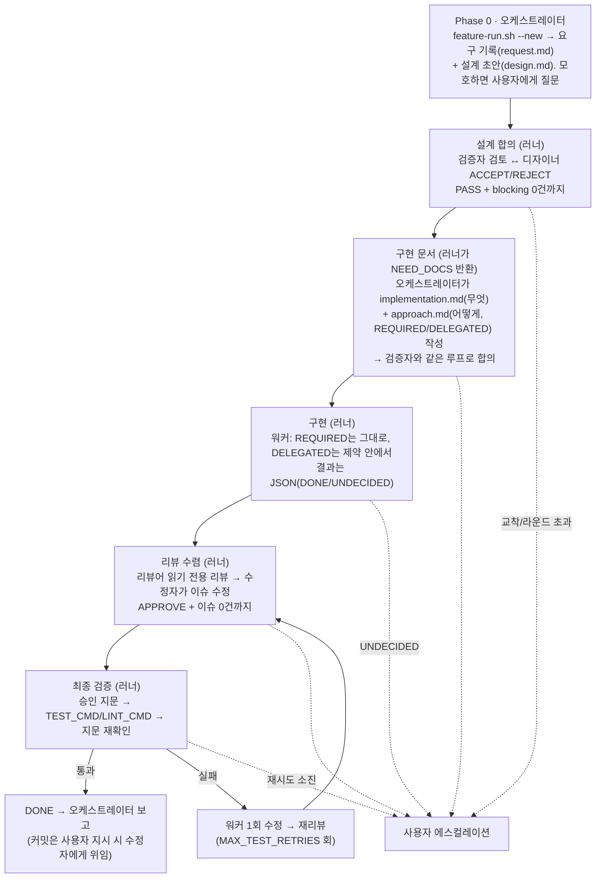

# feature-skill

Claude Code용 **다중 에이전트 합의 파이프라인 스킬**.

복잡한 피처 하나를 역할이 분리된 AI 실행들이 "설계 합의 → 구현 문서 합의 → 구현 → 리뷰 수렴 → 최종 테스트"로
끝까지 처리한다. 문서는 검증자와 합의될 때까지 구현을 시작하지 않는다. 코드는 리뷰어가 승인할 때까지
파이프라인이 끝나지 않는다. 막히면 사람에게 올라온다.

## 역할

| 역할 | 모델·effort 설정 | CLI | 하는 일 |
|---|---|---|---|
| **오케스트레이터·디자이너** | `DESIGNER_MODEL` / `DESIGNER_EFFORT` | claude (대화 세션 + 비대화형 문서 수정) | 요구 해석, 설계 문서·구현 문서 작성/수정, 최종 테스트 |
| **검증자** | `VALIDATOR_MODEL` / `VALIDATOR_EFFORT` | codex `--sandbox read-only` | 설계·구현 문서를 각각 검증, BLOCK/PASS 판정 |
| **워커** | `WORKER_MODEL` / `WORKER_EFFORT` | codex `--sandbox workspace-write` | 합의된 구현 문서대로 메인 구현 (테스트 우선) |
| **리뷰어** | `REVIEWER_MODEL` / `REVIEWER_EFFORT` | claude (읽기 전용 비대화형) | 구현 리뷰, APPROVE/REQUEST_CHANGES 판정 |
| **수정자** | `FIXER_MODEL` / `FIXER_EFFORT` | claude (비대화형) | 리뷰 이슈 직접 수정, (사용자 지시 시) 커밋 |

제어권은 항상 오케스트레이터 세션 하나에만 있다. 나머지는 전부 비대화형 하위 실행이다.

## 파이프라인



### 왜 문서가 세 개인가

- `design.md`: **왜·무엇을** 만드는지(요구 수준). 목표, API/데이터 계약, 에러·동시성 처리, 테스트 기준, 비범위
- `implementation.md`: **무엇을** 코드로 바꾸는지(도메인 지식). 파일 목록·순서, 클래스/함수 수준 계획, 테스트 목록, 완료 기준
- `approach.md`: **어떻게** 구현하는지(CS 지식), 구현 **결정** 단위로 REQUIRED/DELEGATED 표시. 함수별 기법·구조·금지 방식 + 근거. 근거는 기존 프로젝트 패턴 최우선(파일·심볼 인용), 없을 때만 그 문제 유형에 가장 적합한 표준 기법과 선택 이유

"무엇"만 적고 "어떻게"를 비워두면 워커가 테스트만 통과하는 수준의 코드를 짜고 그 뒤 어떤 단계도 그것을 결함으로 잡지 않는다. 그래서 워커는 approach.md 를 그대로 옮기는 타이피스트로 두고 기법 결정은 전부 Phase 1.5에서 끝낸다.
설계가 먼저 굳어야 구현 문서 재작성 낭비가 없다. 구현 문서 검증 단계에서 설계 변경이 필요해지면
검증자·디자이너가 임의로 바꾸지 못하고 "설계 재합의 필요"로 REJECT 기록을 남긴다.

## 러너 — `scripts/feature-run.sh`

오케스트레이터(LLM)는 문서 작성과 사용자 질문만 하고, 결정론적 제어는 러너가 맡는다.
`preflight → design → impl → worker → review → verify → done`을 연결하고, 판단이 필요한 상태에서만 종료 코드로 돌아온다.

| exit | status | reason |
|---|---|---|
| 0 | `DONE` | 승인 + 전체 테스트 통과 |
| 3 | `NEED_DOCS` | `DESIGN_MISSING` / `IMPL_DOCS_MISSING`: 오케스트레이터가 문서를 쓸 차례 |
| 2 | `NEED_USER` | `DEADLOCK` / `MAX_ROUNDS` / `UNDECIDED` / `TEST_RETRIES_EXHAUSTED` / `APPROVAL_STALE_REPEATED` |
| 1 | `ENV_ERROR` | CLI·환경 오류 |

재실행은 항상 같은 명령. `run-state.json`(임시 파일 + `mv` 원자 교체)의 stage 힌트를 실제 산출물(합의 PASS 파일, `worker-result.json`, `approved.fingerprint`)과 교차 확인해 재개 지점을 고른다.
러너는 agent 가 아니다 — 자동 루프는 (리뷰 이슈 → 수정 → 재리뷰), (테스트 실패 → 워커 1회 수정 → 재리뷰 → 재테스트) 둘뿐이고, 그 밖의 막힘은 즉시 사람에게 반환한다. 여기에 더 똑똑한 복구를 넣지 않는 것이 설계 의도다.

## 신뢰성 장치

- **수렴 강제**: PASS/APPROVE는 스키마 검증된 JSON 파일로만 인정. 이슈 0건과 동시일 때만 통과
  (판정과 이슈 목록이 모순이면 스크립트가 거부). 동일 이슈가 내용 변화 없이 2라운드 반복되면 교착으로
  판정하고 멈춘다.
- **승인 독립성**: 리뷰 세션(`reviewer`)과 수정 세션(`fixer`)은 절대 합치지 않는다.
  마지막 APPROVE 이후 코드가 한 줄이라도 바뀌면 재리뷰 없이 파이프라인을 끝내지 않는다.
- **설계 모호성은 질문으로**: 추측 금지. 사용자 질문/답변은 `decisions.md`에
  `- [USER-QUESTION] <질문> → <답>` 형식으로 남아 검증자 이슈 판정(ACCEPT/REJECT)과 구분 추적된다.
- **커밋 통제**: 워커는 커밋·푸시 불가(claude 훅 + codex 훅 이중 차단). 커밋은 사용자가 요청했을 때만
  오케스트레이터가 1회용 `ALLOW_COMMIT` 플래그를 만들고 수정자에게 위임한다.
- **토큰 절약**: 역할별 세션 재사용(`--session-id`/`--resume`)으로 라운드 간 저장소 재탐색을 없애고
  프롬프트 캐시를 살린다. 사용량은 `usage.jsonl`에 라운드별 누적.
- **역할별 규칙 전달**: 필수 `core_rules.md`는 워커에게만 주입하고 선택 `conventions.md`는 디자이너·검증자·워커·리뷰어·수정자 모두에게 주입.
- **실시간 관찰**: 두 루프의 판정, 상세 이슈, 참고사항, 디자이너 반영 결정을 `.agent-work/live.log`에 누적. `./feature-live` 로 스트리밍 관찰.

## 구조

```
.claude/
├── settings.json                # claude 훅 등록
├── hooks/
│   ├── core_rules.md            # 워커에게만 주입되는 필수 구현 규칙 (프로젝트에 맞게 수정)
│   ├── inject_conventions.sh    # UserPromptSubmit: 선택적 프로젝트 규범 주입
│   └── pre_bash_guard.sh        # 지시 없는 git commit/push 차단 (ALLOW_COMMIT 플래그)
└── skills/feature/
    ├── SKILL.md                 # 파이프라인 정의 (Phase 0 ~ 4, 강제 규칙)
    ├── config.sh                # 모델/effort/라운드 한도/프로젝트 명령 + 가드 + 헬퍼
    ├── prompts/                 # 역할별 페르소나 템플릿 (7개, envsubst 변수 치환)
    ├── schemas/                 # 검증자/리뷰어 판정 JSON 스키마
    └── scripts/
        ├── consensus-loop.sh    # 문서 합의 루프 — `design` | `impl` 인자 겸용
        └── impl-review-loop.sh  # 구현 리뷰 수렴 루프

.codex/
├── hooks.json                   # codex PreToolUse 훅 등록 (프로젝트 레벨)
└── hooks/worker_guard.sh        # 워커 가드: commit/push 차단 (프로젝트별 보호는 직접 추가)

feature-live                     # 실시간 로그 뷰어 (./feature-live — tail -f 대체)
conventions.md                   # 선택: 모든 역할에 추가 주입할 프로젝트 규범
```

프롬프트(페르소나)·판정 스키마·흐름 제어가 분리되어 있어 문구 수정은 `prompts/*.md`,
판정 필드 변경은 `schemas/*.json`, 루프 정책은 `scripts/*.sh`만 건드리면 된다.

## 요구사항

- [Claude Code](https://claude.com/claude-code) CLI (`claude`) — 로그인 상태
- OpenAI Codex CLI (`codex`) — 로그인 상태
- `jq`, `uuidgen`, `envsubst`(gettext) — macOS: `brew install jq gettext`
- git 저장소 (브랜치 생성·diff 리뷰·훅 판정에 사용)

## 설치

1. 이 저장소의 `.claude/` 와 `.codex/` 를 대상 저장소 루트에 복사한다.
   이미 `.claude/settings.json` 이 있으면 hooks 항목을 병합한다.
2. `.claude/skills/feature/config.sh` 의 `CHANGE_ME` 를 채운다.
   ```bash
   DESIGNER_MODEL="<디자이너 모델>"
   DESIGNER_EFFORT="<지원 effort>"
   VALIDATOR_MODEL="<검증자 모델>"
   VALIDATOR_EFFORT="<지원 effort>"
   WORKER_MODEL="<워커 모델>"
   WORKER_EFFORT="<지원 effort>"
   REVIEWER_MODEL="<리뷰어 모델>"
   REVIEWER_EFFORT="<지원 effort>"
   FIXER_MODEL="<수정자 모델>"
   FIXER_EFFORT="<지원 effort>"
   TEST_CMD="<프로젝트 테스트 명령>"    # 예: "npm test", "./gradlew test", "venv/bin/pytest tests -q"
   LINT_CMD="<프로젝트 린트/빌드 검증 명령>"
   ```
   모델별 지원 effort가 다르므로 모델과 effort를 함께 맞춘다. 실제 허용 여부는 각 CLI가 검증한다.
   빈 값이나 `CHANGE_ME`가 남으면 config.sh 가드가 모든 스크립트 실행을 거부한다.
3. (선택) 프로젝트별 보호가 필요하면 훅을 추가한다. 생성 코드·마이그레이션 편집 금지 같은 규칙은
   `.codex/hooks/worker_guard.sh` 와 claude `PreToolUse` 훅에 같은 패턴(경로 grep → exit 2)으로 넣는다.
4. (선택) 저장소 루트에 `conventions.md`를 두면 모든 역할에 주입된다. 파일이 없으면 생략한다. `core_rules.md`는 워커에게만 별도로 주입된다.
5. `.gitignore` 에 `.agent-work/` 를 추가한다.

## 사용

`DESIGNER_MODEL`·`DESIGNER_EFFORT`와 맞춘 Claude Code 세션에서 "feature" 또는 "피처"를 명시하며 기능 구현을 요청하면
스킬이 발동한다. 사소한 수정·단일 파일 변경에는 쓰지 않는다.

```
피처: 주문 취소 API 추가하고 재고 원복까지 처리해줘
```

진행 상황 관찰 (별도 터미널, 저장소 루트에서):

```bash
./feature-live
```

파이프라인 시작 전에 켜도 `live.log` 생성을 기다렸다가 자동으로 스트리밍을 시작한다.

라운드 한도는 `config.sh`에서 조정한다:

```bash
MAX_SPEC_ROUNDS=2    # 문서 합의 라운드 (design/impl 각각 적용)
MAX_IMPL_ROUNDS=2    # 구현 리뷰-수정 라운드
MAX_TEST_RETRIES=1   # 최종 테스트 실패 시 워커 재수정 허용 횟수
```

## 산출물 (`.agent-work/`, gitignore 대상)

| 파일 | 내용 |
|---|---|
| `request.md` | 요구 원문 + 해석 범위 + 제외 사항 |
| `design.md` / `implementation.md` / `approach.md` | 합의된 설계 / 구현 문서(무엇) / 구현 방식 문서(어떻게, REQUIRED/DELEGATED) |
| `run-state.json` / `worker-result.json` | 러너 상태(재개 힌트) / 워커 결과 JSON(`DONE`/`UNDECIDED`, `undecided`, `delegated_choices`, `tests`) |
| `decisions.md` | 이슈별 ACCEPT/REJECT 사유 + `[USER-QUESTION]` 기록 |
| `reviews/` | 라운드별 판정 JSON (`validator-design-*`, `validator-impl-*`, `impl-attempt-*/reviewer-*`) |
| `state.json` / `usage.jsonl` / `live.log` | 단계 상태 / 토큰·비용 누적 / 실시간 로그 |
| `archive/` | 이전 피처 산출물 보관 (새 피처 시작 시 자동 이동) |

## 트러블슈팅

- **`[FAIL] config.sh 의 CHANGE_ME 항목을 먼저 채우세요.`** — 설치 2번을 안 한 것. `TEST_CMD`/`LINT_CMD`를 채운다.
- **`[FAIL] codex 실행 실패 (모델 '...' 확인)`** — codex 계정에서 해당 모델 ID가 유효한지 확인 (`codex -m` 후보 목록).
- **루프가 exit 2로 멈춤** — 버그가 아니라 설계된 에스컬레이션. `state.json`의 `DEADLOCK`/`MAX_ROUNDS_EXCEEDED`와 마지막 리뷰 JSON을 보고 사람이 결정한 뒤 재개한다.
- **codex 훅이 안 걸림** — codex를 저장소 루트에서 실행했는지 확인 (`hooks.json`의 가드 경로가 상대 경로).
- **이전 피처 문맥이 섞임** — `.agent-work/.session-*` 가 남아 있는 것. 새 피처 시작 시 Phase 0의 archive 절차를 따른다.

## Claude Code Agent Teams와의 차이

Claude Code에는 여러 Claude 인스턴스가 협업하는 실험 기능 [Agent Teams](https://code.claude.com/docs/en/agent-teams.md)가 있다
(`CLAUDE_CODE_EXPERIMENTAL_AGENT_TEAMS=1`, 기본 비활성화). 목표는 겹치지만 이 스킬을 대체하지는 않는다:

- **교차 벤더 검증**: Agent Teams는 Claude 모델 전용이다. 이 스킬의 핵심인 "명세·구현을 타사 모델(OpenAI Codex)이
  교차 검증"하는 구조는 팀 기능으로 만들 수 없다. 같은 모델끼리는 맹점도 공유하기 쉽다는 전제에서 출발한 설계다.
- **결정론적 수렴 강제**: 이 스킬은 스키마 검증된 PASS/APPROVE JSON, 모순 응답 거부, 교착 감지, 라운드 한도를
  셸 스크립트가 강제한다. Agent Teams의 협업 흐름은 모델 재량이 크다. 강제는 훅 종료 코드로 우회 구현해야 한다.
- **반대로 Agent Teams가 나은 것**: 팀원 간 직접 통신, 공유 작업 리스트·의존성 자동 관리. 독립 작업 여러 개를
  병렬 분업할 때는 Agent Teams가 자연스럽다.

품질 관문이 필요한 피처 하나, 그러니까 설계 합의에서 구현을 거쳐 리뷰 수렴까지 가야 하는 작업이라면
이 스킬을 쓴다. 독립 작업 여러 개의 병렬 처리는 Agent Teams.

## 라이선스

MIT
